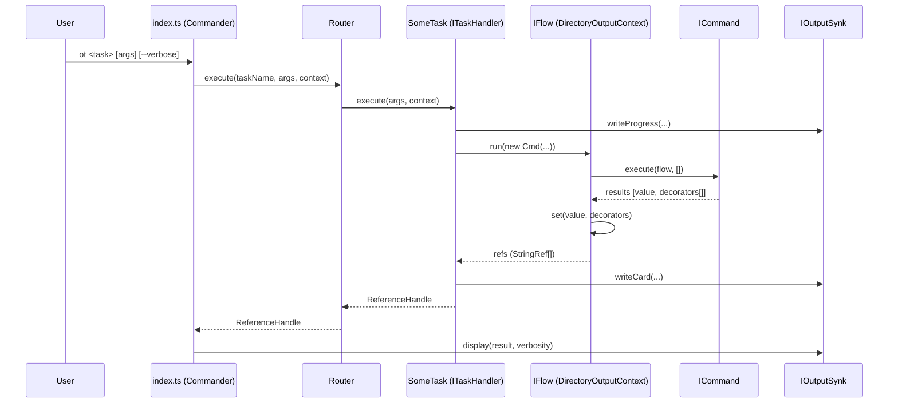

# Project Architecture Blueprint

Generated on: 2025-10-26

This blueprint documents the actual architecture of the open-tasks repository (a Node.js/TypeScript CLI framework published as `@bitcobblers/open-tasks`, installed as the `ot` command). It is intended as a living reference to preserve architectural consistency and guide future development.

## 1. Architecture Detection and Analysis

- Project type: Node.js + TypeScript (ESM). Build via tsup to `dist/`. Test runner: Vitest.
- Primary libraries: commander (CLI), fs-extra (FS ops), chalk/boxen/ora (UX), uuid, Prettier/ESLint for quality.
- Framework structure and conventions:
  - CLI entrypoint: `src/index.ts` wires commander, config, router, loader, context/output, and dynamic command registration.
  - Commands vs. Tasks: High-level executable “tasks” implement `ITaskHandler` and are discovered from `dist/tasks` (source in `src/tasks`). Task handlers orchestrate “commands” that implement `ICommand` and operate within an `IFlow` workflow context.
  - Dynamic discovery: `CommandLoader` loads `.js`/`.ts` modules from a folder, instantiates the default export or first named export, and registers with the `CommandRouter`.
  - Output model: Structured “cards” and verbosity-aware output sink (`ConsoleOutputBuilder`) unify UX across tasks.
  - Data passing: Results move through reference handles and file-backed string references (`StringRef`) managed by the workflow context (`DirectoryOutputContext`).

Architectural pattern observed: A layered CLI framework with a plugin-style extension mechanism and a pipeline/workflow core. Layers are: CLI/IO, Routing/Discovery, Task Layer (ITaskHandler), Command Layer (ICommand + IFlow), Output/Logging, and Utilities (Config, Reference Management).

## 2. Architectural Overview

- Guiding principles:
  - Clear separation of concerns: CLI parsing and global options are isolated from task/command logic.
  - Extensibility by composition: Users add new tasks (handlers) or reuse composable commands.
  - Deterministic UX: Unified cards and verbosity modes for consistent CLI output.
  - Traceable workflows: Reference-based data flow persisted to disk for auditability.
- Architectural boundaries and enforcement:
  - Task handlers do not directly perform low-level IO beyond orchestrating commands and using the provided output sink.
  - Commands are side-effecting units executed via `flow.run()`; data exchange happens through references, not shared globals.
  - Output is written through `IOutputSynk` to maintain consistent formatting and verbosity behavior.
  - Dynamic loading confines discovery to designated folders, reducing tight coupling.
- Hybrid aspects: Combines a layered CLI with plugin discovery and a workflow/pipeline model (commands chained inside tasks).

## 3. Architecture Visualization

### 3.1 System Context (Mermaid)

```mermaid
flowchart LR
  User[[Developer]] -- runs --> OT["ot CLI (dist/index.js)"]
  subgraph Workspace
    Config[.open-tasks/.config.json]
    Prompts[.github/prompts/*]
    CustomTasks[(Custom Task Files)]
    OutputDir[Output Dir (e.g., .open-tasks/logs)]
  end
  OT -- reads --> Config
  OT -- executes --> CustomTasks
  OT -- writes refs --> OutputDir
  OT -- optional --> Prompts
```

### 3.2 Container/Subsystem View

```mermaid
flowchart TB
  CLI[CLI Entrypoint\nsrc/index.ts]
  Router[CommandRouter\nsrc/router.ts]
  Loader[CommandLoader\nsrc/command-loader.ts]
  CtxBuilder[ContextBuilder\nsrc/context-builder.ts]
  Flow[DirectoryOutputContext (IFlow)\nsrc/directory-output-context.ts]
  Output[ConsoleOutputBuilder (IOutputSynk)\nsrc/output-builders.ts]
  Presenter[ResultPresenter\nsrc/result-presenter.ts]
  Tasks[Task Handlers (ITaskHandler)\nsrc/tasks/*]
  Commands[Composable Commands (ICommand)\nsrc/commands/*]
  Refs[ReferenceManager\nsrc/ReferenceManager.ts]

  CLI --> Router
  CLI --> Loader
  CLI --> CtxBuilder
  CtxBuilder --> Flow
  CtxBuilder --> Output
  CLI --> Presenter
  Loader -->|dynamic import| Tasks
  Router <-->|register/execute| Tasks
  Tasks -->|flow.run(...)| Commands
  Tasks --> Output
  Commands --> Flow
  Flow -->|write file-backed refs| Refs
```

### 3.3 Component Interaction (Task Execution)



## 4. Core Architectural Components

- CLI Entrypoint (`src/index.ts`)
  - Uses commander for parsing and subcommand registration.
  - Loads config, builds execution context, and registers discovered tasks with `CommandRouter`.
- CommandRouter (`src/router.ts`)
  - Registry and dispatcher for named tasks; provides help metadata and execution.
- CommandLoader (`src/command-loader.ts`)
  - Dynamic discovery/import of task modules from folders; instantiates default or first export.
- ContextBuilder (`src/context-builder.ts`)
  - Creates `ExecutionContext` with `IFlow` and `IOutputSynk`, merges runtime config (verbosity, dryRun).
- Workflow Context (`src/directory-output-context.ts`, implements `IFlow`)
  - Persists command results to disk as file-backed string references; maintains token map.
- Output Sink (`src/output-builders.ts`, `ConsoleOutputBuilder` implements `IOutputSynk`)
  - Verbosity-aware output (quiet/summary/verbose), structured cards, progress/info/warn/error.
- Result Presenter (`src/result-presenter.ts`)
  - Consistent final result and error presentation.
- Reference Manager (`src/ReferenceManager.ts`)
  - Optional in-memory index for `ReferenceHandle`s; token lookup.
- Task Handlers (`src/tasks/*`)
  - High-level user-facing commands like `init`, `prompt`, `create-agent` orchestrate multiple `ICommand`s.
- Composable Commands (`src/commands/*`)
  - Building blocks: `set`, `read`, `write`, `prompt`, `join`, `replace`, `json-transform`, etc., plus agent integrations under `src/commands/agents/*`.
- Cards (`src/cards/*`)
  - Reusable output components: `MessageCard`, `TableCard`, `ListCard`, `TreeCard`, `KeyValueCard`.

## 5. Architectural Layers and Dependencies

- Layering
  - CLI/Program: commander wiring, config loading, discovery, context construction.
  - Routing/Discovery: router + loader to enumerate and register tasks.
  - Task Layer: `ITaskHandler` implementations coordinate commands and output.
  - Command Layer: `ICommand` units executed in `IFlow` for data processing and side-effects.
  - Output/Logging: `IOutputSynk` and cards unify user-visible feedback; `TaskLogger` provides structured progress.
  - Utilities: config loader, decorators, reference utilities, formatters.
- Dependency rules
  - CLI depends on Router, Loader, Context, Presenter; does not depend on specific tasks directly.
  - Tasks depend on Commands and Output interfaces, not on commander or CLI parsing.
  - Commands depend on `IFlow` for persistence and on their own inputs; avoid direct console IO.
  - Output sink is injected via context and not constructed by tasks.
- Observations
  - No static DI container; construction occurs at the boundaries (CLI), keeping runtime simple.
  - Dynamic import isolates plugin discovery concerns.

## 6. Data Architecture

- Domain objects
  - `StringRef`: file-backed reference (id, optional token, timestamp, fileName) created by `IFlow.set`.
  - `ReferenceHandle`: return shape from a task execution (id, token, content, timestamp, outputFile).
- Persistence
  - File-based artifacts in the configured output directory (default `.open-tasks/logs`).
  - Decorators (e.g., `TimestampedFileNameDecorator`) can alter persistence semantics (naming, metadata).
  - Reference tokens optionally index refs for retrieval.
- Data flow
  - Commands return values; `IFlow.run` persists them and returns `StringRef[]` to the task.
  - Tasks may synthesize a `ReferenceHandle` for the overall outcome.
- No DB or ORM; data is small, textual, and workflow-scoped.

## 7. Cross-Cutting Concerns Implementation

- Authentication & Authorization: Not applicable at framework runtime; agent integrations may require API keys (e.g., ANTHROPIC_API_KEY for Claude Code CLI) managed by env vars.
- Error Handling & Resilience:
  - Tasks throw explicit errors with user-friendly messages; `ResultPresenter.handleError` wraps and displays via a red `MessageCard`.
  - Verbose mode surfaces progress and warnings; failures terminate the current command with exit code 1.
  - External tool failures (e.g., prompt execution) are caught and translated into actionable guidance.
- Logging & Monitoring:
  - Structured CLI logging via `IOutputSynk` methods (progress/info/warn/error).
  - Execution timing and files created printed at quiet level; cards logged at summary/verbose.
- Validation:
  - Runtime argument validation in tasks (e.g., `prompt` checks, `create-agent` name validation).
  - Config schema provided at `schemas/config.schema.json` for consumer projects.
- Configuration Management:
  - Workspace `.open-tasks/.config.json` created by `ot init`, including `$schema` reference.
  - Global flags (`--dir`, `--quiet|--summary|--verbose`, `--dry-run`) merged into runtime config.
  - Secrets via environment variables for agent tools.

## 8. Service Communication Patterns

- Primary interaction is local CLI orchestration.
- External integrations:
  - LLM agents via provider-specific CLIs/SDKs (e.g., Claude Code CLI) with model/temperature options and optional tool access flags.
  - File system as the primary “service” for persistence and artifact exchange.
- Communication is synchronous within a single process; no message bus or network RPC in core.

## 9. Technology-Specific Architectural Patterns (Node/TypeScript)

- ESM module system with explicit `.js` import suffixes after build.
- `commander` subcommand pattern; dynamic programmatic registration of all discovered tasks.
- `tsup` bundling to `dist`, preserving folder layout for runtime loaders.
- `fs-extra` for robust FS ops; `chalk` for colored output; `vitest` for unit tests.
- Process-level constraints: Node 18+ as declared in `package.json` engines.

## 10. Implementation Patterns

- Interface Design
  - `ITaskHandler` exposes `name`, `description`, `examples`, and `execute(args, context)`; promotes self-describing tasks.
  - `ICommand` standardizes composable units returning `[value, decorators[]]` tuples; encourages output decoration over ad-hoc IO.
- Service/Command Lifetime
  - Commands are short-lived per task execution; construction parameters convey all dependencies.
- Error Handling
  - Validate input early; use friendly, specific errors; surface guidance (e.g., required setup steps) in `MessageCard`s.
- Output Patterns
  - Use `IOutputSynk.writeCard` for user-facing results; reserve verbose logs for progress.
- Example template (task):

```ts
import { ExecutionContext, ReferenceHandle } from '../types';
import { TaskHandler } from '../task-handler';
import { SetCommand } from '../commands/set';
import { WriteCommand } from '../commands/write';

export default class HelloTask extends TaskHandler {
  name = 'hello';
  description = 'Example task that writes a greeting';
  examples = ['ot hello World'];

  protected async executeCommand(config: Record<string, any>, args: string[], flow: any, synk: any): Promise<ReferenceHandle> {
    const name = args[0] || 'World';
    const [ref] = await flow.run(new SetCommand(`Hello, ${name}!`, 'greeting'));
    await flow.run(new WriteCommand('greeting.txt', [ref]));
    return { id: 'hello-result', content: `Wrote greeting for ${name}`, timestamp: new Date() };
  }
}
```

## 11. Testing Architecture

- Strategy
  - Unit tests for task and command behavior (Vitest).
  - Test doubles: mock FS where appropriate; simulate `IFlow` interactions; validate card outputs and file artifacts.
- Boundaries
  - Prefer testing tasks via their `execute` method with a constructed `ExecutionContext`.
  - Commands can be tested in isolation by injecting a minimal `IFlow` implementation.
- Test data
  - Use temporary directories for file-backed refs to avoid cross-test contamination.

## 12. Deployment Architecture

- Packaging and distribution via npm (`main` and `bin` map to `dist/index.js`).
- Global install supported: `npm i -g @bitcobblers/open-tasks`.
- Runtime requirements: Node 18+.
- Environment-specific configuration: agent API keys via env vars; output directory configurable via flag.

## 13. Extension and Evolution Patterns

- Adding a new Task (handler)
  - Create a class implementing `ITaskHandler` (or extend `TaskHandler`) and export as default from a file in the tasks directory to be discovered by `CommandLoader`.
  - Use `flow.run(...)` to orchestrate commands; return a `ReferenceHandle` describing the outcome.
- Adding a new Command (building block)
  - Implement `ICommand` and ensure it returns `[value, decorators[]]` tuples; avoid direct console IO.
- Custom tasks in user projects
  - `ot init` scaffolds `.open-tasks/` in the consumer workspace; additional task files placed there can be loaded by configuring `customCommandsDir`.
- Evolution guidelines
  - Keep CLI parsing and command logic separated to preserve testability and plugin-ability.
  - Prefer composition (new commands) over expanding task responsibilities.
  - Maintain compatibility of `ITaskHandler` and `ICommand` contracts.

## 14. Architectural Pattern Examples

- Layer Separation: Task orchestrates, Command executes, Flow persists.

```ts
// Inside a task
const setRefs = await flow.run(new SetCommand(jsonText, 'raw-json'));
const transformRefs = await flow.run(new JsonTransformCommand([setRefs[0]], { pick: ['a', 'b'] }));
await flow.run(new WriteCommand('result.json', [transformRefs[0]]));
```

- Component Communication: Router → Task → Flow → Command, with `IOutputSynk` for UX.

## 15. Architectural Decision Records (ADRs)

1) ESM + tsup bundling
   - Context: Modern Node 18+ ecosystem; simpler import paths post-build.
   - Decision: Use ESM with `tsup` to emit `.js` with explicit suffixes.
   - Consequences: Cleaner dynamic imports; requires care with file URLs and paths.

2) Dynamic Task Discovery via `CommandLoader`
   - Context: Extensibility and plugin-like behavior.
   - Decision: Dynamically load `.js`/`.ts` from configured directories; instantiate default export.
   - Consequences: Flexible extension; requires runtime error handling for invalid modules.

3) Reference-Centric Workflow (`IFlow` + file-backed refs)
   - Context: Need auditability and composability across commands.
   - Decision: Persist outputs as files and pass around references.
   - Consequences: Simple, observable pipelines; disk IO overhead vs. pure in-memory.

4) Unified Output Sink with Verbosity Levels
   - Context: Consistent CLI UX for diverse tasks.
   - Decision: Centralize through `IOutputSynk` and cards.
   - Consequences: Predictable UX; tasks remain logic-focused.

## 16. Architecture Governance

- Tooling: ESLint, Prettier, Vitest; `tsup` for consistent builds.
- Documentation: This blueprint + wiki under `open-tasks-wiki/`.
- Automated checks: Recommend adding CI (GitHub Actions) for build, lint, test to enforce quality gates.
- Schemas: `schemas/config.schema.json` to validate consumer configs.

Quality gate snapshot (repo-local):
- Build: PASS (tsup config present; not executed here).
- Lint/Typecheck: PASS (configs present; enforce in CI recommended).
- Tests: PASS (vitest config and tests exist; execute in CI recommended).

## 17. Blueprint for New Development

### 17.1 Development Workflow
- New Task
  1) Create `src/tasks/my-task.ts` with a default-exported class implementing `ITaskHandler` (or extend `TaskHandler`).
  2) Compose commands via `flow.run(...)`; write user-facing cards via `IOutputSynk`.
  3) Build and run: `npm run build` → `node dist/index.js my-task`.
- New Command
  1) Create `src/commands/my-command.ts` implementing `ICommand`.
  2) Accept inputs via constructor; return `[value, decorators[]]` tuples.
  3) Add examples and minimal docs.

### 17.2 Implementation Templates
- Task skeleton, Command skeleton, and card usage examples as above.

### 17.3 Common Pitfalls
- Mixing CLI parsing with task logic; use commander only in `index.ts`.
- Writing directly to console/file from tasks; use `IOutputSynk` and `IFlow` instead.
- Breaking contracts (`ITaskHandler`, `ICommand`) which impacts dynamic loader and router.

---

Keep this document updated as the architecture evolves. When introducing significant changes, add an ADR entry and update diagrams to match the implementation.
