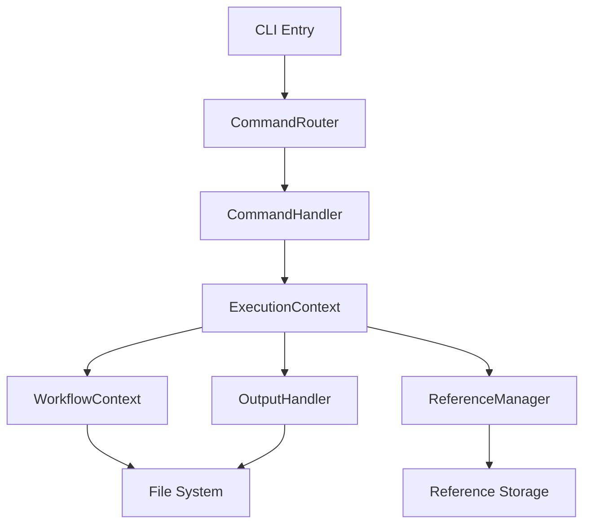

# Open-Tasks CLI Developer Guide

A comprehensive guide for developers to build, test, and debug the Open-Tasks CLI tool.

## Table of Contents
1. [Project Overview](#project-overview)
2. [Development Setup](#development-setup)
3. [Build System & npm Commands](#build-system--npm-commands)
4. [Architecture Deep Dive](#architecture-deep-dive)
5. [Core Concepts](#core-concepts)
6. [Building Custom Commands](#building-custom-commands)
7. [Testing Strategy](#testing-strategy)
8. [VS Code Debugging Setup](#vs-code-debugging-setup)
9. [Development Workflow](#development-workflow)
10. [Troubleshooting](#troubleshooting)

## Project Overview

Open-Tasks CLI is a extensible command-line interface tool built with TypeScript that provides:
- **Task Execution**: Execute commands with explicit workflow context
- **Reference System**: Pass data between commands using token-based references
- **File Persistence**: Automatic output tracking with timestamped files
- **Extensibility**: Easy custom command development
- **Workflow Processing**: Composable operations with context management

### Key Technologies
- **Runtime**: Node.js 18+ (ESM modules)
- **Language**: TypeScript 5.3+
- **Build Tool**: tsup (fast TypeScript bundler)
- **Testing**: Vitest
- **CLI Framework**: Commander.js
- **Styling**: Chalk & Ora

## Development Setup

### Prerequisites
```bash
# Required Node.js version
node --version  # >= 18.0.0

# Clone and setup
git clone <repository-url>
cd open-tasks
```

### Installation
```bash
# Install dependencies
cd open-tasks-cli
npm install

# Build the project
npm run build

# Verify installation
npm link  # Optional: symlink for global testing
open-tasks --help
```

## Build System & npm Commands

### Core npm Scripts

```bash
# Build the project (TypeScript -> ESM)
npm run build

# Development mode with hot reloading
npm run dev

# Run tests
npm test

# Run tests with coverage report
npm run test:coverage

# Lint source code
npm run lint

# Format code with Prettier
npm run format

# Build before publishing
npm run prepublishOnly
```

### Build Configuration (tsup.config.ts)

The project uses `tsup` for fast TypeScript compilation:

```typescript
export default defineConfig({
  entry: {
    index: 'src/index.ts',
    // Auto-discovers all command files
    'commands/init': 'src/commands/init.ts',
    'commands/store': 'src/commands/store.ts',
    // ... other commands
  },
  format: 'esm',           // ES Module output
  dts: true,               // Generate type definitions
  clean: true,             // Clean dist/ before build
  sourcemap: true,         // Source maps for debugging
  splitting: false,        // Single bundle per entry
});
```

### Output Structure

After building, the `dist/` directory contains:

```
dist/
├── index.js                 # Main CLI entry point
├── index.d.ts              # Type definitions
├── index.js.map            # Source map
├── commands/
│   ├── init.js             # Built-in commands
│   ├── init.d.ts
│   ├── store.js
│   ├── store.d.ts
│   └── ...
├── router.js               # Core routing logic
├── types.js                # Core type definitions
└── workflow/
    ├── index.js            # Workflow API
    └── ...
```

## Architecture Deep Dive

### Three-Layer Architecture

#### Layer 1: Workflow Processing (`src/workflow/`)
**Purpose**: Internal API for context-based operations

**Key Components:**
- `IWorkflowContext` interface - Core context operations
- `MemoryRef` type - Structured data references
- `ICommand` interface - Composable operations
- `IMemoryDecorator` interface - Data transformation

**Implementations:**
- `InMemoryWorkflowContext` - Dictionary-based storage
- `DirectoryOutputContext` - File-based persistence
- Decorators: `TokenDecorator`, `FileNameDecorator`, `TimestampedFileNameDecorator`

#### Layer 2: CLI Commands (`src/commands/`)
**Purpose**: User-facing command implementations

**Built-in Commands:**
- **System**: `init`, `create` - Project setup
- **Data**: `store`, `load`, `replace`, `extract` - Data manipulation
- **Integration**: `powershell`, `ai-cli` - External tool integration

#### Layer 3: Command Handler Layer
**Purpose**: Execution framework and routing

**Core Components:**
- `CommandRouter` - Command discovery and execution
- `CommandLoader` - Dynamic command loading
- `ReferenceManager` - Cross-command data sharing
- `OutputHandler` - File output and error handling

### Execution Flow



### Core Type System

```typescript
// Main execution context passed to all commands
interface ExecutionContext {
  cwd: string;                    // Current working directory
  outputDir: string;              // Output directory
  referenceManager: ReferenceManager;
  outputHandler: OutputHandler;
  workflowContext: DirectoryOutputContext;
  config: Record<string, any>;
}

// Base class for all commands
abstract class CommandHandler {
  abstract name: string;
  abstract description: string;
  abstract examples: string[];

  abstract execute(
    args: string[],
    refs: Map<string, ReferenceHandle>,
    context: ExecutionContext
  ): Promise<ReferenceHandle>;
}

// Reference system for data passing
interface ReferenceHandle {
  id: string;
  token?: string;           // Human-readable token
  content: any;             // Command output data
  timestamp: Date;
  outputFile?: string;      // Path to saved file
}
```

## Core Concepts

### 1. Reference System

Commands can pass data to each other using references:

```bash
# Store a value with a token
open-tasks store "Hello World" --token greeting

# Use the stored value in another command
open-tasks replace "template: {greeting}" --ref greeting
```

### 2. Workflow Context

Access to structured data operations:

```typescript
// Inside a command handler
async execute(args, refs, context) {
  const { workflowContext } = context;

  // Store data with metadata
  await workflowContext.store(
    'result',
    this.processData(args),
    {
      fileName: 'processed-data.json',
      token: 'processed'
    }
  );

  // Retrieve data
  const data = await workflowContext.load('result');
}
```

### 3. Automatic File Persistence

All command outputs are automatically saved:

```
.open-tasks/
├── outputs/
│   ├── 20251018T033130-946-greeting.txt    # Timestamped files
│   ├── 20251018T033131-054-processed.json
│   └── 20251018T033132-178-error.txt       # Error reports
├── commands/
│   └── my-custom-command.js                # Custom commands
└── config.json                             # Configuration
```

### 4. Configuration System

Default configuration (`.open-tasks/config.json`):

```json
{
  "outputDir": ".open-tasks/outputs",
  "customCommandsDir": ".open-tasks/commands",
  "timestampFormat": "YYYYMMDD-HHmmss-SSS",
  "defaultFileExtension": "txt",
  "colors": true
}
```

## Building Custom Commands

### Method 1: Using the create command

```bash
# Create a new command template
open-tasks create my-awesome-command

# Edit the generated command
nano .open-tasks/commands/my-awesome-command.js
```

### Method 2: Manual Command Creation

Create `.open-tasks/commands/my-command.js`:

```javascript
import { CommandHandler } from 'open-tasks-cli';

class MyCommandHandler extends CommandHandler {
  name = 'my-command';
  description = 'Description of what this command does';
  examples = [
    'open-tasks my-command --input value',
    'open-tasks my-command --ref previous-output'
  ];

  async execute(args, refs, context) {
    const { referenceManager, outputHandler, workflowContext } = context;

    // Parse arguments
    const options = this.parseArgs(args);

    // Use references if provided
    if (refs.has('input')) {
      const inputData = refs.get('input').content;
      // Process input data
    }

    // Your command logic here
    const result = this.processData(options, refs);

    // Create output file
    const timestamp = new Date().toISOString().replace(/[-:]/g, '');
    const fileName = `${timestamp}-my-command-output.txt`;
    await outputHandler.writeOutput(result, fileName);

    // Create and return reference
    const reference = referenceManager.createReference(
      Date.now().toString(),
      result,
      options.token, // Optional token for reference
      fileName
    );

    return reference;
  }

  parseArgs(args) {
    const options = {};
    for (let i = 0; i < args.length; i += 2) {
      const key = args[i].replace('--', '');
      const value = args[i + 1];
      options[key] = value;
    }
    return options;
  }

  processData(options, refs) {
    // Your processing logic here
    return `Processed: ${JSON.stringify(options)}`;
  }
}

export default MyCommandHandler;
```

### Command Development Best Practices

1. **Error Handling**: Always wrap operations in try-catch blocks
2. **File Naming**: Use timestamps for unique file names
3. **Reference Tokens**: Provide meaningful tokens for data sharing
4. **Documentation**: Include clear examples in the command
5. **Type Safety**: Use TypeScript for development (compile to JS for runtime)

## Testing Strategy

### Running Tests

```bash
# Run all tests
npm test

# Run tests in watch mode
npm test -- --watch

# Run tests with coverage
npm run test:coverage

# Run specific test file
npm test -- workflow.test.ts
```

### Test Structure

```
test/
├── workflow.test.ts        # Workflow context tests
├── router.test.ts          # Command routing tests
├── decorators.test.ts     # Decorator pattern tests
└── integration/            # Integration tests (future)
    └── commands.test.ts
```

### Writing Tests

Example test (`test/workflow.test.ts`):

```typescript
import { describe, it, expect, beforeEach } from 'vitest';
import { DirectoryOutputContext } from '../src/workflow/index.js';
import { fs } from 'fs-extra';
import path from 'path';

describe('DirectoryOutputContext', () => {
  let context;
  let tempDir;

  beforeEach(async () => {
    tempDir = path.join(__dirname, 'temp-test-' + Date.now());
    await fs.ensureDir(tempDir);
    context = new DirectoryOutputContext(tempDir);
  });

  it('should store and retrieve data', async () => {
    const testData = { message: 'Hello World' };

    await context.store('test', testData, { token: 'greeting' });
    const retrieved = await context.load('test');

    expect(retrieved.content).toEqual(testData);
    expect(retrieved.token).toBe('greeting');
  });
});
```

### Test Coverage Goals

- **Unit Tests**: Core functionality (workflow, routing, types)
- **Integration Tests**: Command execution flows
- **Manual Testing**: CLI interaction and user experience

## VS Code Debugging Setup

### 1. Launch Configuration

Create `.vscode/launch.json`:

```json
{
  "version": "0.2.0",
  "configurations": [
    {
      "name": "Debug CLI",
      "type": "node",
      "request": "launch",
      "program": "${workspaceFolder}/open-tasks-cli/src/index.ts",
      "args": ["store", "test data", "--token", "debug"],
      "runtimeArgs": ["--loader", "ts-node/esm"],
      "env": {
        "NODE_OPTIONS": "--experimental-vm-modules"
      },
      "console": "integratedTerminal",
      "internalConsoleOptions": "neverOpen",
      "skipFiles": ["<node_internals>/**"]
    },
    {
      "name": "Debug Custom Command",
      "type": "node",
      "request": "launch",
      "program": "${workspaceFolder}/open-tasks-cli/src/index.ts",
      "args": ["my-custom-command", "--input", "test"],
      "runtimeArgs": ["--loader", "ts-node/esm"],
      "env": {
        "NODE_OPTIONS": "--experimental-vm-modules"
      },
      "console": "integratedTerminal",
      "internalConsoleOptions": "neverOpen",
      "skipFiles": ["<node_internals>/**"]
    },
    {
      "name": "Debug Tests",
      "type": "node",
      "request": "launch",
      "program": "${workspaceFolder}/open-tasks-cli/node_modules/vitest/vitest.mjs",
      "args": ["run", "workflow.test.ts"],
      "console": "integratedTerminal",
      "internalConsoleOptions": "neverOpen"
    }
  ]
}
```

### 2. Development Dependencies

Install debugging dependencies:

```bash
npm install --save-dev ts-node @types/node
```

### 3. VS Code Settings

Add to `.vscode/settings.json`:

```json
{
  "typescript.preferences.importModuleSpecifier": "relative",
  "typescript.suggest.autoImports": true,
  "debug.node.autoAttach": "on",
  "files.exclude": {
    "**/node_modules": true,
    "**/dist": true
  }
}
```

### 4. Breakpoints and Debugging

**Key Debugging Points:**
- `src/index.ts:140` - Command execution entry point
- `src/router.ts:45` - Command routing logic
- `src/types.ts:48` - Reference creation
- Individual command `execute()` methods

**Debugging Workflow:**
1. Set breakpoints in core files
2. Use "Debug CLI" configuration for main flow
3. Use "Debug Custom Command" for specific commands
4. Step through command execution with F10/F11
5. Inspect variables in the debug panel

### 5. Debugging Tips

**Viewing Variables:**
- `context` - Full execution context
- `refs` - Available references
- `args` - Command arguments
- `result` - Command output

**Common Debugging Scenarios:**
```typescript
// Debug reference creation
console.log('Creating reference with:', { id, content, token });

// Debug workflow context
console.log('Workflow context state:', await workflowContext.list());

// Debug command routing
console.log('Available commands:', router.listCommands());
```

## Development Workflow

### 1. Feature Development

```bash
# Start development mode
npm run dev

# Make changes to source files
# Auto-rebuild will happen

# Test your changes
open-tasks your-command --test

# Run tests
npm test

# Commit changes
git add .
git commit -m "feat: add your feature"
```

### 2. Command Development Workflow

```bash
# Create new command
open-tasks create new-feature

# Edit the command file
code .open-tasks/commands/new-feature.js

# Test the command
open-tasks new-feature --test

# Debug the command
# Use VS Code debugging with "Debug Custom Command"

# Add tests
echo "describe('new-feature', () => { ... });" >> test/commands.test.ts

# Run tests
npm test
```

### 3. Release Process

```bash
# Update version
npm version patch|minor|major

# Build final version
npm run build

# Run full test suite
npm run test:coverage

# Publish to npm
npm publish
```

## Troubleshooting

### Common Issues

**1. Module Resolution Errors**
```bash
# Error: Cannot find module
# Solution: Check tsup.config.ts entry points
npm run build  # Rebuild with correct paths
```

**2. Command Not Found**
```bash
# Error: Unknown command
# Solution: Check command registration in router.ts
open-tasks  # List available commands
```

**3. Reference Issues**
```bash
# Error: Reference not found
# Solution: Check reference token spelling and lifecycle
open-tasks store "test" --token mytoken
open-tasks load --ref mytoken
```

**4. Permission Errors**
```bash
# Error: EACCES: permission denied
# Solution: Check file permissions in .open-tasks/
chmod -R 755 .open-tasks/
```

### Debugging Commands

```bash
# Check configuration
cat .open-tasks/config.json

# List outputs
ls -la .open-tasks/outputs/

# Check command registration
open-tasks --help

# Test workflow context
node -e "
import { DirectoryOutputContext } from './src/workflow/index.js';
const ctx = new DirectoryOutputContext('./test-output');
ctx.store('test', { data: 'value' });
"
```

### Performance Optimization

**1. Build Performance**
```bash
# Use watch mode for development
npm run dev

# Clean build occasionally
rm -rf dist/
npm run build
```

**2. Memory Management**
```bash
# Monitor reference usage
# In command: console.log(referenceManager.listReferences());

# Clean old outputs
find .open-tasks/outputs -name "*.txt" -mtime +7 -delete
```

## Additional Resources

- **TypeScript Documentation**: https://www.typescriptlang.org/docs/
- **Vitest Testing**: https://vitest.dev/
- **tsup Build Tool**: https://tsup.egoist.dev/
- **Commander.js**: https://github.com/tj/commander.js/
- **VS Code Debugging**: https://code.visualstudio.com/docs/editor/debugging

## Contributing

1. Fork the repository
2. Create a feature branch
3. Make your changes
4. Add tests for new functionality
5. Ensure all tests pass
6. Submit a pull request

For detailed contribution guidelines, see the project's README.md file.