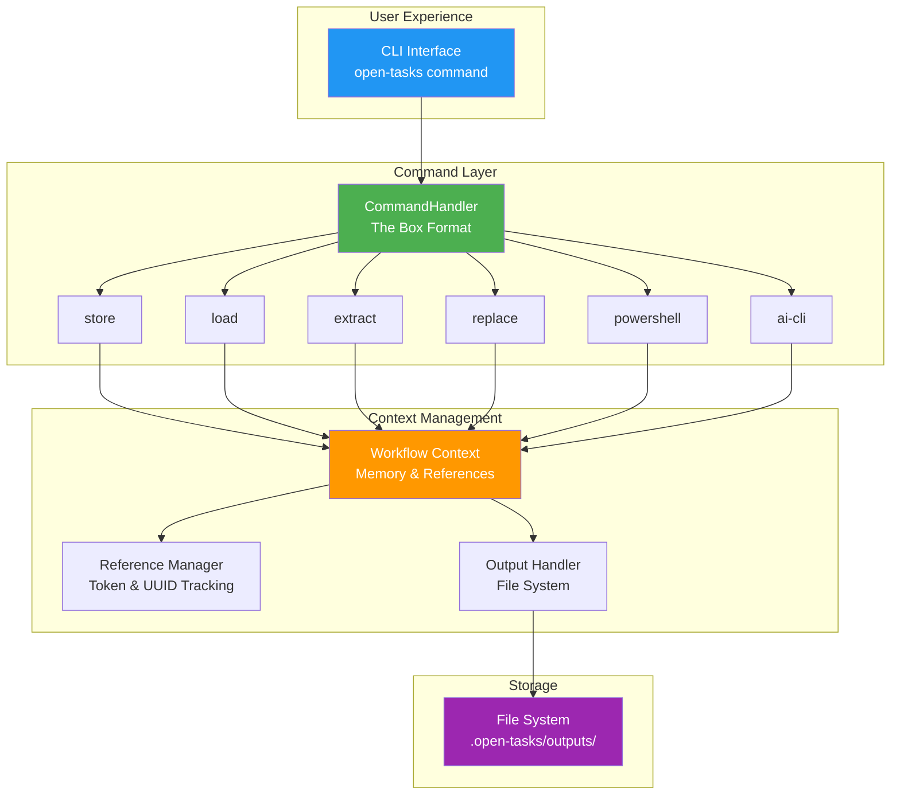
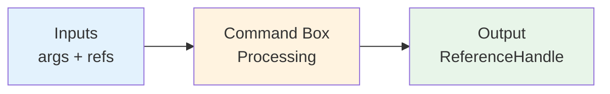
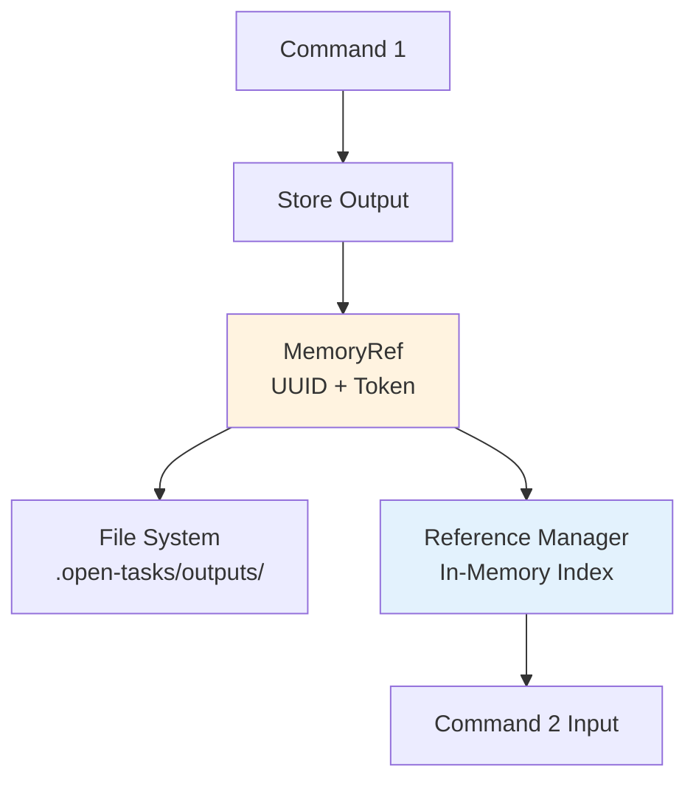
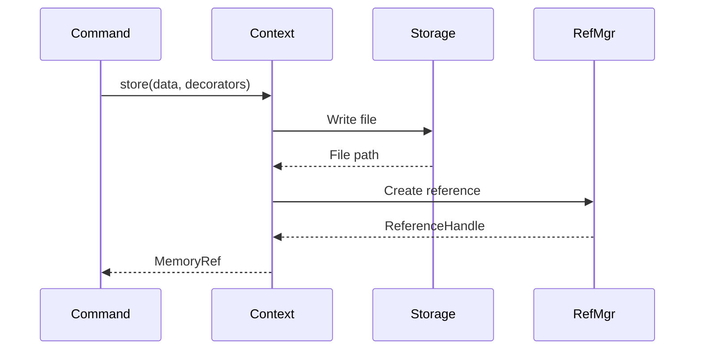
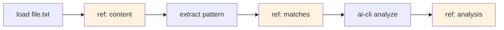
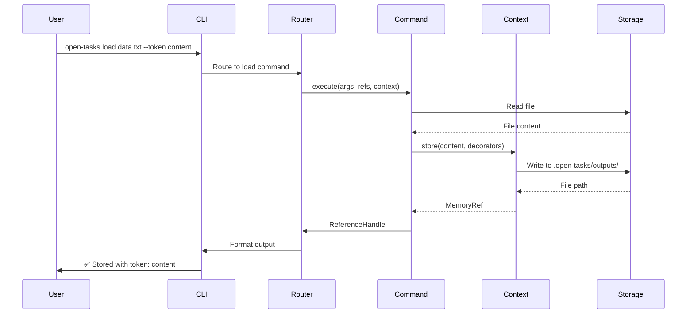

# Architecture & Core Concepts

High-level developer overview of Open Tasks CLI design and structure.

## Overview

Open Tasks CLI is built to enable quick creation of AI-powered command-line workflows. The architecture is designed to make it easy to build context for AI tools without depending on the LLM to figure out what it needs.



## Core Concepts

### 1. The Box Format

Commands follow a consistent pattern called the "box format":



Every command is a box with:
- **Inputs** - Arguments and references from previous commands
- **Processing** - Your custom logic
- **Output** - A reference that can be used by next commands

This makes commands:
- **Composable** - Chain together easily
- **Predictable** - Same interface for all
- **Testable** - Clear inputs and outputs

### 2. References & Memory

The system uses references to pass data between commands:



**ReferenceHandle Structure:**
```typescript
{
  id: 'uuid-1234',           // Unique identifier
  token: 'my-token',          // Optional named token
  content: 'data...',         // Actual content
  outputFile: '.open-tasks/outputs/...',  // File path
  timestamp: Date             // When created
}
```

**Two Ways to Reference:**
1. **By Token** - Named references: `--ref my-token`
2. **By UUID** - Unique IDs: `--ref uuid-1234`

### 3. Workflow Context

The Workflow Context manages the flow of data:



**Key Responsibilities:**
- Store command outputs
- Create references with tokens
- Manage file system operations
- Track reference metadata

### 4. Command Chaining

Commands chain by passing references:



**Example Flow:**
```bash
# Step 1: Load file → creates reference
open-tasks load data.txt --token content

# Step 2: Extract data → uses reference, creates new reference
open-tasks extract "[a-z]+@[a-z.]+" --ref content --token emails

# Step 3: Analyze with AI → uses reference
open-tasks ai-cli "Categorize these emails" --ref emails
```

## Three-Layer Architecture

### Layer 1: IWorkflowContext (Internal API)

**Purpose**: Internal functions used by task and command implementations  
**Visibility**: NOT exposed to end users directly

```typescript
interface IWorkflowContext {
  // Store a value and create a MemoryRef
  store(value: string, transforms: IMemoryDecorator[]): Promise<MemoryRef>;
  
  // Look up the latest value for a token
  token(name: string): string | undefined;
  
  // Execute a command implementation
  run(command: ICommand): Promise<MemoryRef[]>;
}
```

**Key Point**: Users NEVER invoke `context.store()` directly from the CLI. These are implementation details used within tasks.

### Layer 2: Tasks (User-Facing CLI Commands)

**Purpose**: Tasks users invoke via `open-tasks <task-name>`  
**Visibility**: Public CLI interface

**Two Types:**

**1. System Commands** - Project management
```bash
open-tasks init     # Initialize project structure
open-tasks create   # Scaffold task templates
```

**2. User Tasks** - Custom workflows
```bash
open-tasks analyze-repo   # User-defined task
open-tasks process-data   # User-defined task
```

- Located in `.open-tasks/tasks/`
- Extend `TaskHandler` abstract class
- Compose commands to build workflows
- Auto-discovered and exposed as CLI commands

### Layer 3: Commands (Composable Operations)

**Purpose**: Executable operations composed within tasks  
**Visibility**: API for task developers

**Two Types:**

**1. Pre-built Commands** - Library commands
```typescript
import { PowershellCommand, ClaudeCommand, FileCommand } from 'open-tasks-cli/commands';
```

**2. Custom Commands** - User-defined ICommand implementations
```typescript
class MyCustomCommand implements ICommand {
  async execute(context: IWorkflowContext): Promise<MemoryRef[]> {
    // Custom logic
  }
}
```

## Architectural Diagram

```
┌─────────────────────────────────────────────────────┐
│  USER                                                │
│  Invokes: open-tasks analyze-repo                   │
└────────────────────┬────────────────────────────────┘
                     │
                     ▼
┌─────────────────────────────────────────────────────┐
│  LAYER 2: Tasks (CLI Commands)                      │
│  • System Commands (init, create)                   │
│  • User Tasks (.open-tasks/tasks/*.ts)              │
│  • TaskHandler implementations                      │
└────────────────────┬────────────────────────────────┘
                     │
                     ▼
┌─────────────────────────────────────────────────────┐
│  LAYER 3: Commands (ICommand implementations)       │
│  • Pre-built Commands (library)                     │
│    - PowershellCommand                              │
│    - ClaudeCommand                                  │
│    - RegexCommand                                   │
│  • Custom Commands (user-defined)                   │
└────────────────────┬────────────────────────────────┘
                     │
                     ▼
┌─────────────────────────────────────────────────────┐
│  LAYER 1: IWorkflowContext (Internal API)           │
│  • context.store()                                  │
│  • context.token()                                  │
│  • context.run()                                    │
│  (NOT exposed to users)                             │
└─────────────────────────────────────────────────────┘
```

## Core Types

### TaskHandler

Abstract class for CLI-invokable tasks:

```typescript
abstract class TaskHandler {
  static name: string;          // Task name (CLI command)
  static description: string;   // Help text
  
  abstract execute(
    args: string[],               // CLI arguments
    context: IWorkflowContext     // Workflow API
  ): Promise<TaskOutcome>;        // Structured results
}
```

### ICommand

Interface for executable operations:

```typescript
interface ICommand {
  execute(context: IWorkflowContext): Promise<MemoryRef[]>;
}
```

### TaskOutcome

Structured result from task execution:

```typescript
interface TaskOutcome {
  id: string;           // Unique execution ID
  name: string;         // Task name
  logs: TaskLog[];      // Operation logs
  errors: string[];     // Error messages
}
```

### TaskLog

Tracking entry for each operation:

```typescript
interface TaskLog {
  id: string;           // MemoryRef ID
  token?: string;       // MemoryRef token
  fileName: string;     // MemoryRef file
  command: string;      // Command type executed
  args: any[];          // Command arguments
  start: Date;          // Start timestamp
  end: Date;            // End timestamp
}
```

### MemoryRef

Reference to stored values:

```typescript
interface MemoryRef {
  id: string;         // Unique identifier (UUID)
  token?: string;     // Optional token name
  fileName: string;   // Path to output file
}
```

## Command Flow

### 1. CLI Invocation

```bash
open-tasks analyze-repo ./src
```

### 2. Task Discovery

- CLI scans `.open-tasks/tasks/` directory
- Finds `analyze-repo.ts` (or `.js`)
- Loads TaskHandler class

### 3. Task Execution

```typescript
export default class AnalyzeRepoTask extends TaskHandler {
  static name = 'analyze-repo';
  
  async execute(args: string[], context: IWorkflowContext): Promise<TaskOutcome> {
    // Execute workflow
  }
}
```

### 4. Command Composition

```typescript
// Task composes commands
const cmd1 = new PowershellCommand("git log --oneline -10");
const [logRef] = await context.run(cmd1);

const cmd2 = new ClaudeCommand("Analyze this git history", [logRef]);
const [analysisRef] = await context.run(cmd2);
```

### 5. Context Operations

```typescript
// IWorkflowContext handles:
// - Storing values → MemoryRef
// - Looking up tokens
// - Running commands
// - Managing outputs
```

### 6. Result Return

```typescript
return {
  id: generateId(),
  name: 'analyze-repo',
  logs: [/* TaskLog entries */],
  errors: []
};
```

## Data Flow

### MemoryRef Chain

```
PowershellCommand
    ↓
  MemoryRef { id: "uuid-1", fileName: ".open-tasks/outputs/..." }
    ↓
ClaudeCommand (uses uuid-1 as input)
    ↓
  MemoryRef { id: "uuid-2", fileName: ".open-tasks/outputs/..." }
    ↓
FileCommand (uses uuid-2 to write file)
```

### Context Store Flow

```typescript
// 1. Store value
const ref = await context.store(
  "data",
  [new TokenDecorator('mytoken')]
);

// 2. Creates file
// .open-tasks/outputs/20251018-143022-456-mytoken.txt

// 3. Returns MemoryRef
{
  id: "uuid-123",
  token: "mytoken",
  fileName: ".open-tasks/outputs/20251018-143022-456-mytoken.txt"
}

// 4. Later retrieval
const value = context.token('mytoken');  // Returns file content
```

## Directory Structure

```
your-project/
├── .open-tasks/
│   ├── tasks/                           # User tasks (Layer 2)
│   │   ├── analyze-repo.ts
│   │   ├── process-data.ts
│   │   └── ...
│   ├── outputs/                         # Task execution outputs
│   │   ├── 20251018T140000000Z-analyze-repo/
│   │   │   ├── 20251018T140001000Z-log.txt
│   │   │   └── 20251018T140002000Z-analysis.md
│   │   └── 20251018T150000000Z-process-data/
│   │       └── 20251018T150001000Z-result.txt
│   └── config.json                      # Configuration
├── src/                                  # Your application code
└── package.json
```

## Component Responsibilities

### CLI Entry Point

- Parse command-line arguments
- Load configuration
- Initialize services
- Route to appropriate TaskHandler

### Task Discovery

- Scan `.open-tasks/tasks/` directory
- Load TypeScript/JavaScript files
- Register TaskHandler classes
- Map task names to handlers

### Task Execution

- Validate arguments
- Create IWorkflowContext instance
- Execute task's `execute()` method
- Collect TaskOutcome
- Display results

### IWorkflowContext

- Manage MemoryRef creation and storage
- Provide token lookup functionality
- Execute ICommand implementations
- Track operations in context

### Output Management

- Create timestamped files in `.open-tasks/outputs/`
- Apply decorators (token, timestamp, custom)
- Manage file lifecycle
- Provide content retrieval

### Terminal Formatting

- Color-coded output (chalk)
- Progress indicators (ora)
- Structured result display
- Error highlighting

## Design Principles

### 1. Explicit Dependencies
Build context explicitly rather than hoping AI figures it out:
```typescript
// Explicit: You control what context to gather
const code = await loadFile('./app.ts');
const tests = await loadFile('./app.test.ts');
const docs = await loadFile('./README.md');

// Now AI has everything it needs
await aiAnalyze([code, tests, docs]);
```

### 2. Composable Operations
Small, focused commands that chain together:
```bash
open-tasks load file.txt --token content
open-tasks extract "pattern" --ref content --token data
open-tasks ai-cli "analyze" --ref data
```

### 3. Type Safety
TypeScript throughout for better developer experience:
```typescript
interface ReferenceHandle {
  id: string;
  token?: string;
  content: any;
  outputFile?: string;
  timestamp: Date;
}
```

### 4. Observable Execution
Every step is tracked and logged:
- File outputs for all operations
- Timestamped directories for isolation
- References track data flow
- Clear error messages

### 5. Zero Magic
Everything is explicit:
- No hidden context gathering
- No automatic dependency resolution
- You control the workflow
- Predictable behavior

## Execution Flow

Complete flow from CLI invocation to output:



## Key Components

### CommandHandler (The Box)
```typescript
export default class MyCommand extends CommandHandler {
  name = 'my-command';
  description = 'What it does';
  examples = ['open-tasks my-command arg'];
  
  async execute(
    args: string[],                      // CLI arguments
    refs: Map<string, ReferenceHandle>,  // Previous outputs
    context: ExecutionContext            // System context
  ): Promise<ReferenceHandle> {          // Your output
    // Your logic here
  }
}
```

### ExecutionContext
Provides access to core services:
```typescript
interface ExecutionContext {
  cwd: string;                           // Current directory
  outputDir: string;                     // Where to write files
  referenceManager: ReferenceManager;    // Track references
  outputHandler: OutputHandler;          // Write files
  workflowContext: DirectoryOutputContext; // Store data
  config: Record<string, any>;           // User config
}
```

### Workflow Context
Manages data flow:
```typescript
interface IWorkflowContext {
  store(content: any, decorators: IMemoryDecorator[]): Promise<MemoryRef>;
  load(filePath: string, decorators: IMemoryDecorator[]): Promise<MemoryRef>;
  transform(ref: MemoryRef, transformer: ITransformer): Promise<MemoryRef>;
}
```

## Directory Structure

```
project/
├── .open-tasks/
│   ├── commands/              # Custom commands (deprecated pattern)
│   ├── outputs/               # All command outputs
│   │   ├── 20240119T143022-load/
│   │   │   └── content.txt
│   │   └── 20240119T143045-extract/
│   │       └── matches.txt
│   ├── config.json            # Configuration
│   └── ai-config.json         # AI CLI configuration (optional)
├── src/                       # Your code
└── package.json
```

**Output Organization:**
- Each command execution gets its own timestamped directory
- Files within use: `{timestamp}-{token}.txt`
- Prevents naming conflicts
- Easy to trace execution history
- Clean separation between workflow steps

## Integration Points

### AI CLI Tools
Open Tasks integrates with any AI CLI tool:

```json
{
  "command": "gh copilot suggest",
  "contextFlag": "-t",
  "timeout": 30000
}
```

Supported tools:
- GitHub Copilot CLI
- Claude Code CLI
- OpenAI CLI
- Custom AI tools

### Shell Commands
Execute any shell command via PowerShell:

```bash
open-tasks powershell "git log --oneline -10"
open-tasks powershell "npm test"
open-tasks powershell "docker ps"
```

### File System
All operations use the file system:
- Load files with `load`
- Store results with `store`
- Extract with `extract`
- Replace with `replace`

## Summary

**Open Tasks CLI Architecture:**

1. **Box Format** - Consistent command interface (inputs → processing → output)
2. **References** - Pass data between commands via tokens/UUIDs
3. **Workflow Context** - Manages data flow and storage
4. **Three Layers** - Internal API, CLI commands, composable operations
5. **Explicit Dependencies** - Build context manually for AI tools
6. **Type Safe** - TypeScript throughout
7. **Observable** - Track all operations with files and logs
8. **Composable** - Chain commands to build workflows

## Next Steps

- **[[Building-Custom-Commands]]** - Create reusable commands
- **[[Building-Custom-Tasks]]** - Build complex workflows
- **[[Commands]]** - Reference for all built-in commands
- **[[Example-Tasks]]** - Real-world implementations
