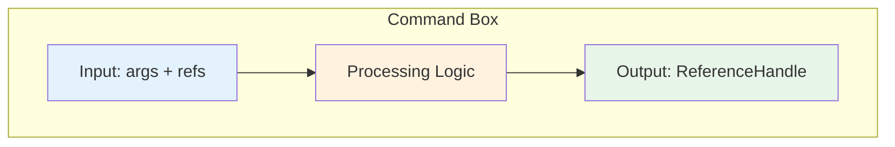
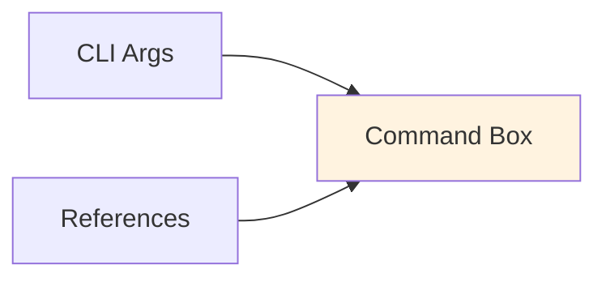
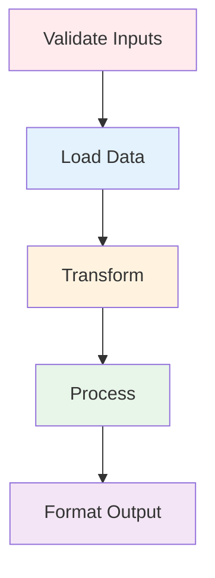
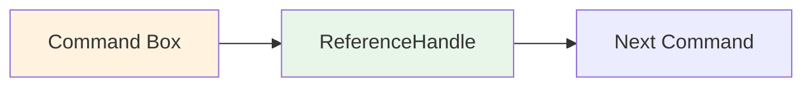

# Building Custom Commands

Learn how to build reusable commands using the CommandHandler pattern (the "box format").

## Overview

Commands are the building blocks of Open Tasks CLI. They follow a consistent pattern (the "box format") that makes them easy to understand, compose, and reuse.



## The Box Format

Think of each command as a "box" with:
- **Inputs** - Arguments and references from previous commands
- **Processing** - Your custom logic
- **Outputs** - A reference that can be used by other commands

This consistent interface makes commands composable and predictable.

## Command Structure

### Basic Template

```typescript
import { CommandHandler, ExecutionContext, ReferenceHandle } from 'open-tasks-cli';
import { TokenDecorator } from 'open-tasks-cli/decorators';

export default class MyCommand extends CommandHandler {
  // 1. Command metadata
  name = 'my-command';
  description = 'What this command does';
  examples = [
    'open-tasks my-command arg1',
    'open-tasks my-command arg1 --ref input'
  ];

  // 2. Main execution method
  async execute(
    args: string[],                           // Command-line arguments
    refs: Map<string, ReferenceHandle>,       // Referenced inputs from other commands
    context: ExecutionContext                  // Execution context (filesystem, config, etc.)
  ): Promise<ReferenceHandle> {               // Returns a reference to the output
    
    // 3. Process inputs
    const input = this.getInput(args, refs);
    
    // 4. Do your work
    const result = await this.process(input);
    
    // 5. Store and return output
    return this.storeOutput(result, context);
  }
  
  // Helper methods
  private getInput(args: string[], refs: Map<string, ReferenceHandle>): any {
    // Extract and validate inputs
  }
  
  private async process(input: any): Promise<any> {
    // Your processing logic
  }
  
  private async storeOutput(
    result: any,
    context: ExecutionContext
  ): Promise<ReferenceHandle> {
    // Store result and create reference
    const ref = await context.workflowContext.store(
      result,
      [new TokenDecorator('output')]
    );
    
    return context.referenceManager.createReference(
      ref.id,
      result,
      'my-command-output',
      ref.fileName
    );
  }
}
```

## Understanding the Box Format

### Input Side (Left Side of Box)



**Arguments (`args: string[]`)**
- Command-line arguments passed by user
- Example: `open-tasks my-command file.txt --verbose`
  - `args[0]` = `"file.txt"`
  - `args[1]` = `"--verbose"`

**References (`refs: Map<string, ReferenceHandle>`)**
- Outputs from previous commands
- Accessed by token or UUID
- Contains content and metadata

**Context (`context: ExecutionContext`)**
- Provides access to:
  - Workflow context (for storing data)
  - Reference manager (for creating references)
  - Output handler (for file operations)
  - Configuration (user settings)

### Processing (Inside the Box)



This is where your custom logic lives:
1. **Validate** - Check inputs are correct
2. **Load** - Get data from files, APIs, etc.
3. **Transform** - Convert data formats
4. **Process** - Do the main work
5. **Format** - Prepare output for next command

### Output Side (Right Side of Box)



**ReferenceHandle**
- Unique ID for tracking
- Optional token for easy reference
- Content (the actual data)
- File path where content is stored
- Timestamp

## Complete Examples

### Example 1: Simple Transform Command

Transform text to uppercase:

```typescript
import { CommandHandler, ExecutionContext, ReferenceHandle } from 'open-tasks-cli';
import { TokenDecorator } from 'open-tasks-cli/decorators';

export default class UppercaseCommand extends CommandHandler {
  name = 'uppercase';
  description = 'Convert text to uppercase';
  examples = [
    'open-tasks uppercase "hello world"',
    'open-tasks uppercase --ref input'
  ];

  async execute(
    args: string[],
    refs: Map<string, ReferenceHandle>,
    context: ExecutionContext
  ): Promise<ReferenceHandle> {
    // Get input from args or refs
    let input: string;
    
    if (refs.size > 0) {
      // Use first reference
      const firstRef = Array.from(refs.values())[0];
      input = firstRef.content;
    } else if (args.length > 0) {
      // Use command-line argument
      input = args.join(' ');
    } else {
      throw new Error('Please provide text as argument or --ref');
    }
    
    // Transform
    const result = input.toUpperCase();
    
    // Store and return
    const ref = await context.workflowContext.store(
      result,
      [new TokenDecorator('uppercase')]
    );
    
    return context.referenceManager.createReference(
      ref.id,
      result,
      'uppercase-output',
      ref.fileName
    );
  }
}
```

**Usage:**
```bash
# Direct input
open-tasks uppercase "hello world"

# With reference
open-tasks store "hello world" --token input
open-tasks uppercase --ref input
```

### Example 2: File Processing Command

Count words in a file:

```typescript
import { CommandHandler, ExecutionContext, ReferenceHandle } from 'open-tasks-cli';
import { TokenDecorator } from 'open-tasks-cli/decorators';
import * as fs from 'fs/promises';

export default class WordCountCommand extends CommandHandler {
  name = 'word-count';
  description = 'Count words in a file or text';
  examples = [
    'open-tasks word-count file.txt',
    'open-tasks word-count --ref content'
  ];

  async execute(
    args: string[],
    refs: Map<string, ReferenceHandle>,
    context: ExecutionContext
  ): Promise<ReferenceHandle> {
    // Get content
    let content: string;
    
    if (refs.size > 0) {
      const firstRef = Array.from(refs.values())[0];
      content = firstRef.content;
    } else if (args[0]) {
      content = await fs.readFile(args[0], 'utf-8');
    } else {
      throw new Error('Usage: open-tasks word-count <file> OR --ref <token>');
    }
    
    // Count words
    const words = content.split(/\s+/).filter(w => w.length > 0);
    const lines = content.split('\n');
    const chars = content.length;
    
    // Format result
    const result = `
Statistics:
- Words: ${words.length}
- Lines: ${lines.length}
- Characters: ${chars}
    `.trim();
    
    console.log(result);
    
    // Store and return
    const ref = await context.workflowContext.store(
      result,
      [new TokenDecorator('stats')]
    );
    
    return context.referenceManager.createReference(
      ref.id,
      result,
      'word-count',
      ref.fileName
    );
  }
}
```

### Example 3: Data Extraction Command

Extract specific fields from JSON:

```typescript
import { CommandHandler, ExecutionContext, ReferenceHandle } from 'open-tasks-cli';
import { TokenDecorator } from 'open-tasks-cli/decorators';
import * as fs from 'fs/promises';

export default class JSONExtractCommand extends CommandHandler {
  name = 'json-extract';
  description = 'Extract fields from JSON';
  examples = [
    'open-tasks json-extract data.json name email',
    'open-tasks json-extract --ref data name'
  ];

  async execute(
    args: string[],
    refs: Map<string, ReferenceHandle>,
    context: ExecutionContext
  ): Promise<ReferenceHandle> {
    // Parse arguments
    let jsonSource: string;
    let fields: string[];
    
    if (refs.size > 0) {
      const firstRef = Array.from(refs.values())[0];
      jsonSource = firstRef.content;
      fields = args; // All args are field names
    } else {
      jsonSource = await fs.readFile(args[0], 'utf-8');
      fields = args.slice(1); // First arg is file, rest are fields
    }
    
    if (fields.length === 0) {
      throw new Error('Please specify fields to extract');
    }
    
    // Parse JSON
    let data: any;
    try {
      data = JSON.parse(jsonSource);
    } catch (error) {
      throw new Error(`Invalid JSON: ${error.message}`);
    }
    
    // Extract fields
    const extracted: any = {};
    
    if (Array.isArray(data)) {
      // Extract from array of objects
      extracted.items = data.map(item => {
        const obj: any = {};
        fields.forEach(field => {
          obj[field] = this.getNestedValue(item, field);
        });
        return obj;
      });
    } else {
      // Extract from single object
      fields.forEach(field => {
        extracted[field] = this.getNestedValue(data, field);
      });
    }
    
    // Format result
    const result = JSON.stringify(extracted, null, 2);
    
    console.log('Extracted fields:', fields.join(', '));
    
    // Store and return
    const ref = await context.workflowContext.store(
      result,
      [new TokenDecorator('extracted')]
    );
    
    return context.referenceManager.createReference(
      ref.id,
      result,
      'json-extract',
      ref.fileName
    );
  }
  
  private getNestedValue(obj: any, path: string): any {
    return path.split('.').reduce((current, key) => current?.[key], obj);
  }
}
```

**Usage:**
```bash
# From file
open-tasks json-extract users.json name email

# From reference
open-tasks load data.json --token data
open-tasks json-extract --ref data name email

# Nested fields
open-tasks json-extract data.json user.name user.email
```

### Example 4: External Tool Integration

Call external APIs or tools:

```typescript
import { CommandHandler, ExecutionContext, ReferenceHandle } from 'open-tasks-cli';
import { TokenDecorator } from 'open-tasks-cli/decorators';
import * as child_process from 'child_process';
import { promisify } from 'util';

const exec = promisify(child_process.exec);

export default class GitLogCommand extends CommandHandler {
  name = 'git-log';
  description = 'Get git commit history';
  examples = [
    'open-tasks git-log',
    'open-tasks git-log 20',
    'open-tasks git-log 10 --format oneline'
  ];

  async execute(
    args: string[],
    refs: Map<string, ReferenceHandle>,
    context: ExecutionContext
  ): Promise<ReferenceHandle> {
    // Parse arguments
    const count = parseInt(args[0]) || 10;
    const format = args[1] === '--format' ? args[2] : 'medium';
    
    // Build git command
    let gitCmd = `git log -${count}`;
    
    if (format === 'oneline') {
      gitCmd += ' --oneline';
    } else if (format === 'short') {
      gitCmd += ' --format=short';
    }
    
    console.log(`📜 Fetching last ${count} commits...`);
    
    // Execute git command
    let output: string;
    try {
      const { stdout } = await exec(gitCmd);
      output = stdout;
    } catch (error) {
      throw new Error(`Git command failed: ${error.message}`);
    }
    
    console.log(`✅ Retrieved ${count} commits`);
    
    // Store and return
    const ref = await context.workflowContext.store(
      output,
      [new TokenDecorator('git-log')]
    );
    
    return context.referenceManager.createReference(
      ref.id,
      output,
      'git-log',
      ref.fileName
    );
  }
}
```

## Advanced Patterns

### Pattern 1: Multiple Outputs

Some commands may need to return multiple results:

```typescript
async execute(
  args: string[],
  refs: Map<string, ReferenceHandle>,
  context: ExecutionContext
): Promise<ReferenceHandle> {
  // Process and create multiple outputs
  const output1 = await context.workflowContext.store(
    'First output',
    [new TokenDecorator('output1')]
  );
  
  const output2 = await context.workflowContext.store(
    'Second output',
    [new TokenDecorator('output2')]
  );
  
  // Return a combined reference
  const combined = `Output 1: ${output1.fileName}\nOutput 2: ${output2.fileName}`;
  const combinedRef = await context.workflowContext.store(
    combined,
    [new TokenDecorator('combined')]
  );
  
  return context.referenceManager.createReference(
    combinedRef.id,
    combined,
    'multi-output',
    combinedRef.fileName
  );
}
```

### Pattern 2: Configuration-Driven

Use configuration for flexibility:

```typescript
async execute(
  args: string[],
  refs: Map<string, ReferenceHandle>,
  context: ExecutionContext
): Promise<ReferenceHandle> {
  // Read command-specific config
  const config = context.config['my-command'] || {};
  const option1 = config.option1 || 'default';
  const option2 = config.option2 || false;
  
  // Use config in processing
  const result = this.processWithOptions(input, option1, option2);
  
  // ... rest of command
}
```

Config in `.open-tasks/config.json`:
```json
{
  "outputDir": ".open-tasks/outputs",
  "my-command": {
    "option1": "custom-value",
    "option2": true
  }
}
```

### Pattern 3: Progress Reporting

Provide feedback during long operations:

```typescript
async execute(
  args: string[],
  refs: Map<string, ReferenceHandle>,
  context: ExecutionContext
): Promise<ReferenceHandle> {
  const steps = ['Load', 'Process', 'Transform', 'Save'];
  const total = steps.length;
  
  for (let i = 0; i < total; i++) {
    const step = steps[i];
    console.log(`[${i + 1}/${total}] ${step}...`);
    
    await this.performStep(step);
    
    console.log(`✅ ${step} complete`);
  }
  
  // ... return result
}
```

### Pattern 4: Error Recovery

Handle errors gracefully:

```typescript
async execute(
  args: string[],
  refs: Map<string, ReferenceHandle>,
  context: ExecutionContext
): Promise<ReferenceHandle> {
  try {
    // Attempt operation
    const result = await this.riskyOperation();
    return this.storeSuccess(result, context);
    
  } catch (error) {
    // Log error
    console.error(`❌ Error: ${error.message}`);
    
    // Try fallback
    try {
      console.log('🔄 Attempting fallback...');
      const fallbackResult = await this.fallbackOperation();
      return this.storeSuccess(fallbackResult, context);
      
    } catch (fallbackError) {
      // Both failed, return error reference
      return this.storeError(error, context);
    }
  }
}
```

## Best Practices

### 1. Clear Input Validation

Validate early and provide helpful messages:

```typescript
if (args.length === 0 && refs.size === 0) {
  throw new Error(
    'Usage: open-tasks my-command <input>\n' +
    'Or: open-tasks my-command --ref <token>'
  );
}

if (args[0] && !fs.existsSync(args[0])) {
  throw new Error(`File not found: ${args[0]}`);
}
```

### 2. Descriptive Output

Make output meaningful:

```typescript
console.log('Processing:', inputFile);
console.log('Options:', JSON.stringify(options));
console.log('Result:', result);
console.log('✅ Saved to:', outputPath);
```

### 3. Use Decorators

Leverage decorators for metadata:

```typescript
import { TokenDecorator, TimestampDecorator } from 'open-tasks-cli/decorators';

const ref = await context.workflowContext.store(
  result,
  [
    new TokenDecorator('my-result'),
    new TimestampDecorator()
  ]
);
```

### 4. Type Safety

Use TypeScript types:

```typescript
interface MyCommandOptions {
  format: 'json' | 'text' | 'csv';
  verbose: boolean;
}

private parseOptions(args: string[]): MyCommandOptions {
  return {
    format: (args.includes('--format') 
      ? args[args.indexOf('--format') + 1] 
      : 'text') as 'json' | 'text' | 'csv',
    verbose: args.includes('--verbose')
  };
}
```

### 5. Reusable Helpers

Extract common logic:

```typescript
export default class MyCommand extends CommandHandler {
  // ... command implementation
  
  // Reusable helper
  private async loadContent(
    source: string | ReferenceHandle
  ): Promise<string> {
    if (typeof source === 'string') {
      return await fs.readFile(source, 'utf-8');
    } else {
      return source.content;
    }
  }
}
```

## Testing Commands

### Manual Testing

```bash
# Create test inputs
echo "test data" > test.txt

# Test command
open-tasks my-command test.txt

# Test with references
open-tasks store "test" --token test
open-tasks my-command --ref test

# Test error cases
open-tasks my-command nonexistent.txt
```

### Unit Testing

```typescript
import { describe, it, expect } from 'vitest';
import MyCommand from './.open-tasks/commands/my-command';

describe('MyCommand', () => {
  it('should process input correctly', async () => {
    const cmd = new MyCommand();
    const args = ['test'];
    const refs = new Map();
    const context = createMockContext();
    
    const result = await cmd.execute(args, refs, context);
    
    expect(result.content).toBe('expected output');
  });
});
```

## Next Steps

- **[[Building-Custom-Tasks]]** - Compose commands into workflows
- **[[Example-Tasks]]** - See real-world implementations
- **[[Commands]]** - Reference for built-in commands
- **[[Architecture]]** - Understanding the system design
