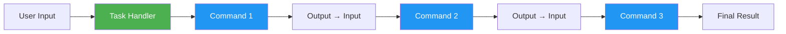
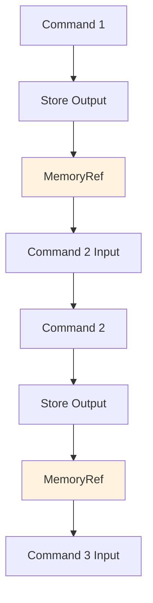

# Building Custom Tasks

Learn how to create powerful custom workflow tasks by chaining commands together.

## Overview

Tasks in Open Tasks CLI are TypeScript files that orchestrate multiple commands to accomplish complex workflows. They allow you to build reusable, composable automation scripts with clean, type-safe code.



## Key Concepts

### Task Structure

A task is a TypeScript class that:
- Extends `CommandHandler` base class
- Has a unique name (becomes the CLI command)
- Implements the `execute()` method
- Returns a `ReferenceHandle` with the result

### Command Chaining

Tasks chain commands by:
1. Executing a command with `context.workflowContext.store()`
2. Storing the output as a reference
3. Passing that reference to the next command
4. Repeating until complete

### Output Passing

Outputs flow between commands through the workflow context:



## Quick Start

### 1. Create Task Template

```bash
open-tasks create my-workflow
```

This creates `.open-tasks/commands/my-workflow.ts` with a template.

### 2. Basic Task Structure

```typescript
import { CommandHandler, ExecutionContext, ReferenceHandle } from 'open-tasks-cli';
import { TokenDecorator } from 'open-tasks-cli/decorators';

export default class MyWorkflowCommand extends CommandHandler {
  name = 'my-workflow';
  description = 'Description of what this task does';
  examples = [
    'open-tasks my-workflow arg1',
    'open-tasks my-workflow arg1 arg2'
  ];

  async execute(
    args: string[],
    refs: Map<string, ReferenceHandle>,
    context: ExecutionContext
  ): Promise<ReferenceHandle> {
    // Your workflow logic here
    
    // Return final result
    return context.referenceManager.createReference(
      'id',
      'content',
      'token'
    );
  }
}
```

### 3. Run Your Task

```bash
open-tasks my-workflow
```

## Building Workflows

### Pattern 1: Linear Command Chain

Execute commands in sequence, passing output to the next:

```typescript
import { CommandHandler, ExecutionContext, ReferenceHandle } from 'open-tasks-cli';
import { TokenDecorator } from 'open-tasks-cli/decorators';
import * as fs from 'fs/promises';

export default class LinearWorkflowCommand extends CommandHandler {
  name = 'linear-workflow';
  description = 'Process data through multiple steps';
  examples = ['open-tasks linear-workflow input.txt'];

  async execute(
    args: string[],
    refs: Map<string, ReferenceHandle>,
    context: ExecutionContext
  ): Promise<ReferenceHandle> {
    const inputFile = args[0];
    
    // Step 1: Load input
    console.log('📖 Loading input...');
    const input = await fs.readFile(inputFile, 'utf-8');
    const inputRef = await context.workflowContext.store(
      input,
      [new TokenDecorator('input')]
    );
    
    // Step 2: Transform data
    console.log('🔄 Transforming data...');
    const transformed = input.toUpperCase(); // Example transformation
    const transformedRef = await context.workflowContext.store(
      transformed,
      [new TokenDecorator('transformed')]
    );
    
    // Step 3: Process with external tool
    console.log('⚙️  Processing...');
    const processed = await this.processData(transformed);
    const processedRef = await context.workflowContext.store(
      processed,
      [new TokenDecorator('processed')]
    );
    
    console.log('✅ Workflow complete!');
    
    return context.referenceManager.createReference(
      processedRef.id,
      processed,
      'final-output',
      processedRef.fileName
    );
  }
  
  private async processData(data: string): Promise<string> {
    // Your processing logic
    return data;
  }
}
```

### Pattern 2: Parallel Data Processing

Process multiple inputs simultaneously:

```typescript
import { CommandHandler, ExecutionContext, ReferenceHandle } from 'open-tasks-cli';
import { TokenDecorator } from 'open-tasks-cli/decorators';

export default class ParallelWorkflowCommand extends CommandHandler {
  name = 'parallel-workflow';
  description = 'Process multiple files in parallel';
  examples = ['open-tasks parallel-workflow file1.txt file2.txt file3.txt'];

  async execute(
    args: string[],
    refs: Map<string, ReferenceHandle>,
    context: ExecutionContext
  ): Promise<ReferenceHandle> {
    const files = args;
    
    if (files.length === 0) {
      throw new Error('Please provide at least one file');
    }
    
    console.log(`📂 Processing ${files.length} files...`);
    
    // Process all files in parallel
    const results = await Promise.all(
      files.map(async (file, index) => {
        console.log(`📖 Reading ${file}...`);
        const content = await fs.readFile(file, 'utf-8');
        
        // Process each file
        const processed = await this.processFile(content);
        
        // Store with unique token
        return await context.workflowContext.store(
          processed,
          [new TokenDecorator(`file-${index}`)]
        );
      })
    );
    
    console.log('✅ All files processed!');
    
    // Combine results
    const combined = results
      .map((ref, i) => `File ${i + 1}:\n${ref.content}`)
      .join('\n\n---\n\n');
    
    const finalRef = await context.workflowContext.store(
      combined,
      [new TokenDecorator('combined')]
    );
    
    return context.referenceManager.createReference(
      finalRef.id,
      combined,
      'parallel-output',
      finalRef.fileName
    );
  }
  
  private async processFile(content: string): Promise<string> {
    // Your processing logic
    return content;
  }
}
```

### Pattern 3: Conditional Workflow

Execute different commands based on conditions:

```typescript
import { CommandHandler, ExecutionContext, ReferenceHandle } from 'open-tasks-cli';
import { TokenDecorator } from 'open-tasks-cli/decorators';
import * as fs from 'fs/promises';

export default class ConditionalWorkflowCommand extends CommandHandler {
  name = 'conditional-workflow';
  description = 'Process file differently based on type';
  examples = ['open-tasks conditional-workflow data.json'];

  async execute(
    args: string[],
    refs: Map<string, ReferenceHandle>,
    context: ExecutionContext
  ): Promise<ReferenceHandle> {
    const filePath = args[0];
    
    console.log(`📖 Loading ${filePath}...`);
    const content = await fs.readFile(filePath, 'utf-8');
    
    // Determine file type
    const fileType = this.detectFileType(filePath, content);
    console.log(`📋 Detected type: ${fileType}`);
    
    let result: string;
    
    // Process based on type
    if (fileType === 'json') {
      result = await this.processJSON(content);
    } else if (fileType === 'csv') {
      result = await this.processCSV(content);
    } else if (fileType === 'text') {
      result = await this.processText(content);
    } else {
      result = content; // Pass through
    }
    
    const resultRef = await context.workflowContext.store(
      result,
      [new TokenDecorator('processed')]
    );
    
    console.log('✅ Processing complete!');
    
    return context.referenceManager.createReference(
      resultRef.id,
      result,
      'output',
      resultRef.fileName
    );
  }
  
  private detectFileType(path: string, content: string): string {
    if (path.endsWith('.json')) return 'json';
    if (path.endsWith('.csv')) return 'csv';
    if (content.startsWith('{') || content.startsWith('[')) return 'json';
    if (content.includes(',') && content.includes('\n')) return 'csv';
    return 'text';
  }
  
  private async processJSON(content: string): Promise<string> {
    const data = JSON.parse(content);
    return JSON.stringify(data, null, 2);
  }
  
  private async processCSV(content: string): Promise<string> {
    // CSV processing logic
    return content;
  }
  
  private async processText(content: string): Promise<string> {
    // Text processing logic
    return content;
  }
}
```

### Pattern 4: AI-Powered Workflow

Integrate AI for intelligent processing:

```typescript
import { CommandHandler, ExecutionContext, ReferenceHandle } from 'open-tasks-cli';
import { TokenDecorator } from 'open-tasks-cli/decorators';
import * as child_process from 'child_process';
import { promisify } from 'util';

const exec = promisify(child_process.exec);

export default class AIWorkflowCommand extends CommandHandler {
  name = 'ai-workflow';
  description = 'Process data with AI assistance';
  examples = ['open-tasks ai-workflow document.txt'];

  async execute(
    args: string[],
    refs: Map<string, ReferenceHandle>,
    context: ExecutionContext
  ): Promise<ReferenceHandle> {
    const inputFile = args[0];
    
    // Step 1: Load document
    console.log('📖 Loading document...');
    const content = await fs.readFile(inputFile, 'utf-8');
    const contentRef = await context.workflowContext.store(
      content,
      [new TokenDecorator('content')]
    );
    
    // Step 2: Extract key information
    console.log('🔍 Extracting metadata...');
    const metadata = await this.extractMetadata(content);
    const metadataRef = await context.workflowContext.store(
      JSON.stringify(metadata, null, 2),
      [new TokenDecorator('metadata')]
    );
    
    // Step 3: Process with AI
    console.log('🤖 Requesting AI analysis...');
    const analysis = await this.analyzeWithAI(content, metadata);
    const analysisRef = await context.workflowContext.store(
      analysis,
      [new TokenDecorator('analysis')]
    );
    
    // Step 4: Generate report
    console.log('📄 Generating report...');
    const report = this.generateReport(content, metadata, analysis);
    const reportRef = await context.workflowContext.store(
      report,
      [new TokenDecorator('report')]
    );
    
    console.log('✅ Analysis complete!');
    
    return context.referenceManager.createReference(
      reportRef.id,
      report,
      'ai-report',
      reportRef.fileName
    );
  }
  
  private async extractMetadata(content: string): Promise<any> {
    return {
      wordCount: content.split(/\s+/).length,
      lineCount: content.split('\n').length,
      hasCodeBlocks: content.includes('```'),
      hasLinks: content.includes('http'),
    };
  }
  
  private async analyzeWithAI(content: string, metadata: any): Promise<string> {
    try {
      const prompt = `
Analyze this document and provide:
1. Main topics
2. Key points
3. Summary
4. Recommendations

Metadata: ${JSON.stringify(metadata)}

Content:
${content}
      `.trim();
      
      // Try to call AI CLI
      const { stdout } = await exec(
        `echo "${prompt.replace(/"/g, '\\"')}" | open-tasks ai-cli -`
      );
      return stdout;
    } catch (error) {
      // Fallback if AI not configured
      return `AI analysis not available. Metadata: ${JSON.stringify(metadata, null, 2)}`;
    }
  }
  
  private generateReport(content: string, metadata: any, analysis: string): string {
    return `
# Document Analysis Report

## Metadata
- Word Count: ${metadata.wordCount}
- Line Count: ${metadata.lineCount}
- Has Code: ${metadata.hasCodeBlocks ? 'Yes' : 'No'}
- Has Links: ${metadata.hasLinks ? 'Yes' : 'No'}

## AI Analysis
${analysis}

## Document Preview
${content.substring(0, 500)}...

---
Generated: ${new Date().toISOString()}
    `.trim();
  }
}
```

## Advanced Techniques

### Error Handling

Always handle errors gracefully:

```typescript
async execute(
  args: string[],
  refs: Map<string, ReferenceHandle>,
  context: ExecutionContext
): Promise<ReferenceHandle> {
  try {
    // Your workflow logic
    
  } catch (error) {
    console.error(`❌ Error: ${error.message}`);
    
    // Store error information
    const errorRef = await context.workflowContext.store(
      `Error: ${error.message}\n\nStack: ${error.stack}`,
      [new TokenDecorator('error')]
    );
    
    return context.referenceManager.createReference(
      errorRef.id,
      `Error occurred: ${error.message}`,
      'error',
      errorRef.fileName
    );
  }
}
```

### Progress Reporting

Keep users informed:

```typescript
const steps = ['Load', 'Process', 'Analyze', 'Report'];
let currentStep = 0;

for (const step of steps) {
  currentStep++;
  console.log(`[${currentStep}/${steps.length}] ${step}...`);
  
  // Do work
  await this.performStep(step);
  
  console.log(`✅ ${step} complete`);
}
```

### Validation

Validate inputs before processing:

```typescript
async execute(
  args: string[],
  refs: Map<string, ReferenceHandle>,
  context: ExecutionContext
): Promise<ReferenceHandle> {
  // Validate arguments
  if (args.length === 0) {
    throw new Error('Usage: open-tasks my-workflow <input-file>');
  }
  
  const inputFile = args[0];
  
  // Validate file exists
  try {
    await fs.access(inputFile);
  } catch {
    throw new Error(`File not found: ${inputFile}`);
  }
  
  // Validate file type
  if (!inputFile.endsWith('.txt')) {
    throw new Error('Only .txt files are supported');
  }
  
  // Continue with processing...
}
```

### Using Helper Functions

Organize complex logic:

```typescript
export default class ComplexWorkflowCommand extends CommandHandler {
  name = 'complex-workflow';
  description = 'Complex multi-step workflow';
  examples = ['open-tasks complex-workflow'];

  async execute(
    args: string[],
    refs: Map<string, ReferenceHandle>,
    context: ExecutionContext
  ): Promise<ReferenceHandle> {
    // High-level workflow
    const input = await this.loadInput(args[0]);
    const processed = await this.processInput(input);
    const analyzed = await this.analyzeResults(processed);
    const report = await this.generateReport(analyzed);
    
    return this.storeResult(report, context);
  }
  
  private async loadInput(path: string): Promise<string> {
    // Load and validate
  }
  
  private async processInput(data: string): Promise<any> {
    // Process logic
  }
  
  private async analyzeResults(data: any): Promise<any> {
    // Analysis logic
  }
  
  private async generateReport(data: any): Promise<string> {
    // Report generation
  }
  
  private async storeResult(
    report: string,
    context: ExecutionContext
  ): Promise<ReferenceHandle> {
    const ref = await context.workflowContext.store(
      report,
      [new TokenDecorator('report')]
    );
    
    return context.referenceManager.createReference(
      ref.id,
      report,
      'output',
      ref.fileName
    );
  }
}
```

## Best Practices

### 1. Single Responsibility
Each task should have one clear purpose:
```typescript
// Good: Focused task
class AnalyzeCodeCommand extends CommandHandler { }

// Bad: Too broad
class DoEverythingCommand extends CommandHandler { }
```

### 2. Descriptive Names
Use clear, action-oriented names:
```typescript
// Good
name = 'analyze-repository';
name = 'generate-report';
name = 'process-logs';

// Bad
name = 'task1';
name = 'helper';
```

### 3. Clear Examples
Provide helpful usage examples:
```typescript
examples = [
  'open-tasks analyze-code ./src/app.ts',
  'open-tasks analyze-code ./src/app.ts --verbose',
  'open-tasks analyze-code ./src/ --recursive'
];
```

### 4. Good Error Messages
Make errors actionable:
```typescript
// Good
throw new Error('File not found: ./data.txt. Please check the path and try again.');

// Bad
throw new Error('Error');
```

### 5. Progress Feedback
Keep users informed:
```typescript
console.log('🔍 Analyzing file...');
// ... work
console.log('✅ Analysis complete!');
console.log('📁 Results saved to:', outputPath);
```

## Testing Your Tasks

### Manual Testing

```bash
# Test with different inputs
open-tasks my-workflow test1.txt
open-tasks my-workflow test2.txt

# Test error cases
open-tasks my-workflow nonexistent.txt

# Test with flags
open-tasks my-workflow data.txt --verbose
```

### Debugging

Add debug output:
```typescript
if (process.env.DEBUG) {
  console.log('Debug: Input:', input);
  console.log('Debug: State:', this.state);
}
```

Run with debugging:
```bash
DEBUG=1 open-tasks my-workflow data.txt
```

## Next Steps

- **[[Building-Custom-Commands]]** - Create reusable command components
- **[[Example-Tasks]]** - See real-world task implementations
- **[[Commands]]** - Reference for built-in commands
- **[[Architecture]]** - Understanding the system design
