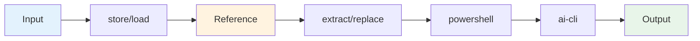

# Commands

Complete reference for all built-in commands in Open Tasks CLI.

## Overview

Open Tasks CLI provides several built-in commands that you can use immediately. These commands form the building blocks for creating custom tasks and workflows.



## Command Reference

### `store` - Store Values

Store a value and create a reference for use in other commands.

**Syntax:**
```bash
open-tasks store <value> [--token <name>]
```

**Arguments:**
- `<value>` - The value to store (string, can be multi-line)

**Options:**
- `--token <name>` - Assign a named token to reference this value later

**Examples:**

```bash
# Store a simple string
open-tasks store "Hello World"

# Store with a named token
open-tasks store "API response data" --token api-result

# Store multi-line content (use quotes)
open-tasks store "Line 1
Line 2
Line 3" --token multiline

# Store from command output (PowerShell)
$data = Get-Content ./file.txt
open-tasks store "$data" --token filedata
```

**Output:**
- Creates a file in `.open-tasks/outputs/{timestamp}-store/`
- Returns a reference with UUID and optional token
- File is named: `{timestamp}-{token|uuid}.txt`

**Use Cases:**
- Store intermediate results
- Save data for later processing
- Create named references for template substitution

---

### `load` - Load Files

Load content from a file and create a reference.

**Syntax:**
```bash
open-tasks load <filepath> [--token <name>]
```

**Arguments:**
- `<filepath>` - Path to the file to load (relative or absolute)

**Options:**
- `--token <name>` - Assign a named token to reference this value later

**Examples:**

```bash
# Load a text file
open-tasks load ./data.txt

# Load with token for later reference
open-tasks load ./template.html --token template

# Load JSON file
open-tasks load ./config.json --token config

# Load from absolute path
open-tasks load /etc/hosts --token hosts
```

**Output:**
- Creates a reference to the file content
- File content is stored in memory and in output directory
- Returns reference with UUID and optional token

**Use Cases:**
- Load configuration files
- Read templates for substitution
- Import data files for processing
- Read code files for AI analysis

---

### `replace` - Template Substitution

Replace tokens in a template string with referenced values.

**Syntax:**
```bash
open-tasks replace <template> --ref <token1> [--ref <token2> ...]
```

**Arguments:**
- `<template>` - Template string with `{{token}}` placeholders

**Options:**
- `--ref <token>` - Reference to use for substitution (can be specified multiple times)

**Token Format:**
- Use `{{token}}` in templates
- Tokens are case-sensitive
- Unreplaced tokens remain as-is with a warning

**Examples:**

```bash
# Simple replacement
open-tasks store "World" --token name
open-tasks replace "Hello {{name}}!" --ref name

# Multiple replacements
open-tasks store "John" --token first
open-tasks store "Doe" --token last
open-tasks replace "Name: {{first}} {{last}}" --ref first --ref last

# Template file with replacements
open-tasks load ./template.html --token tmpl
open-tasks store "My Website" --token title
open-tasks replace "{{tmpl}}" --ref tmpl --ref title
```

**Output:**
- Creates a file with replaced content
- Warns about unreplaced tokens
- Returns reference to output

**Use Cases:**
- Generate configuration files
- Fill in templates with dynamic data
- Create personalized documents
- Build reports with variable content

---

### `extract` - Regex Extraction

Extract text from content using regular expressions.

**Syntax:**
```bash
open-tasks extract <pattern> --ref <input> [--all] [--token <name>]
```

**Arguments:**
- `<pattern>` - Regular expression pattern (use quotes)

**Options:**
- `--ref <input>` - Reference to content to extract from (required)
- `--all` - Extract all matches (default: first match only)
- `--token <name>` - Assign a named token to the result

**Pattern Notes:**
- Uses JavaScript regex syntax
- Capture groups return matched groups, not full match
- Without capture groups, returns the full match

**Examples:**

```bash
# Extract first number
open-tasks store "Price: $42.99" --token price
open-tasks extract "\$([0-9.]+)" --ref price

# Extract all emails
open-tasks load ./contacts.txt --token contacts
open-tasks extract "[a-z]+@[a-z.]+" --ref contacts --all

# Extract with capture groups
open-tasks store "Name: John Doe" --token name
open-tasks extract "Name: ([A-Z][a-z]+) ([A-Z][a-z]+)" --ref name

# Extract URLs from HTML
open-tasks load ./page.html --token html
open-tasks extract 'href="([^"]+)"' --ref html --all --token urls
```

**Output:**
- Returns matched text (or captured groups)
- With `--all`: newline-separated matches
- Without `--all`: first match only

**Use Cases:**
- Parse log files
- Extract specific data from text
- Find patterns in code
- Collect URLs or email addresses

---

### `powershell` - Execute PowerShell

Execute PowerShell scripts and capture output.

**Syntax:**
```bash
open-tasks powershell <script> [--ref <token1> ...] [--token <name>]
```

**Arguments:**
- `<script>` - PowerShell script to execute (use quotes for multi-line)

**Options:**
- `--ref <token>` - Reference to use for substitution in script (can be specified multiple times)
- `--token <name>` - Assign a named token to the output

**Script Substitution:**
- Use `{{token}}` in script for reference substitution
- References are replaced before execution

**Examples:**

```bash
# Simple command
open-tasks powershell "Get-Date"

# With reference substitution
open-tasks store "C:\Users" --token path
open-tasks powershell "Get-ChildItem {{path}}" --ref path

# Capture output for later use
open-tasks powershell "Get-Process | Select-Object -First 5" --token processes

# Multi-line script
open-tasks powershell "
  $files = Get-ChildItem *.txt
  $count = $files.Count
  Write-Output 'Found $count files'
"

# Git operations
open-tasks powershell "git log --oneline -10" --token gitlog
open-tasks powershell "git status --short" --token gitstatus
```

**Output:**
- Captures stdout from PowerShell
- Returns reference to output
- stderr is displayed but not captured

**Use Cases:**
- Execute shell commands
- Run git operations
- Query system information
- Process files with PowerShell
- Build/test automation

**Note:** On non-Windows systems, ensure PowerShell Core is installed.

---

### `ai-cli` - AI CLI Integration

Execute AI CLI commands with context from references.

**Syntax:**
```bash
open-tasks ai-cli <prompt> [--ref <context1> ...] [--token <name>]
```

**Arguments:**
- `<prompt>` - Prompt to send to the AI CLI

**Options:**
- `--ref <context>` - Reference to use as context (can be specified multiple times)
- `--token <name>` - Assign a named token to the response

**Configuration Required:**

Create `.open-tasks/ai-config.json`:

```json
{
  "command": "gh copilot suggest",
  "contextFlag": "-t",
  "timeout": 30000
}
```

**Configuration Options:**
- `command` (required) - The AI CLI command to execute
- `contextFlag` (optional) - Flag used to pass context files (default: `-t`)
- `timeout` (optional) - Command timeout in milliseconds (default: 30000)

**Supported AI CLIs:**

#### GitHub Copilot CLI
```json
{
  "command": "gh copilot suggest",
  "contextFlag": "-t",
  "timeout": 30000
}
```

#### OpenAI CLI (unofficial)
```json
{
  "command": "openai-cli",
  "contextFlag": "--context",
  "timeout": 60000
}
```

#### Claude Code CLI
```json
{
  "command": "claude-code",
  "contextFlag": "--file",
  "timeout": 45000
}
```

#### Custom AI Tool
```json
{
  "command": "python /path/to/ai-tool.py",
  "contextFlag": "--file",
  "timeout": 45000
}
```

**Examples:**

```bash
# Simple AI query
open-tasks ai-cli "How do I list files in PowerShell?"

# With context from file
open-tasks load ./code.ts --token code
open-tasks ai-cli "Explain this code" --ref code

# With multiple context files
open-tasks load ./api.ts --token api
open-tasks load ./types.ts --token types
open-tasks ai-cli "How do these files work together?" --ref api --ref types

# Save AI response
open-tasks ai-cli "Suggest improvements" --ref code --token suggestions

# Code review workflow
open-tasks load ./src/app.ts --token app
open-tasks powershell "git log --oneline -5 ./src/app.ts" --token history
open-tasks ai-cli "Review this code and its history" --ref app --ref history --token review
```

**Context File Passing:**

When you use `--ref` flags, the AI CLI receives context files:

```bash
# This command:
open-tasks ai-cli "Explain this" --ref code

# Executes approximately:
gh copilot suggest "Explain this" -t /path/to/code-file.txt
```

**Error Handling:**
- **Missing Configuration**: Command fails with helpful error
- **Timeout**: Command fails if AI doesn't respond within timeout
- **Non-zero Exit Code**: Error is captured and displayed

**Use Cases:**
- Code review and analysis
- Documentation generation
- Bug finding and suggestions
- Explaining complex code
- Generating test cases

---

### `init` - Initialize Project

Create `.open-tasks` directory structure and configuration.

**Syntax:**
```bash
open-tasks init
```

**What It Creates:**
```
.open-tasks/
├── tasks/           # Directory for custom task files
├── outputs/         # Directory for command outputs
└── config.json      # Configuration file
```

**Default Configuration:**
```json
{
  "outputDir": ".open-tasks/outputs",
  "customCommandsDir": ".open-tasks/commands"
}
```

**Examples:**

```bash
# Initialize in current directory
cd my-project
open-tasks init

# Verify initialization
ls -la .open-tasks/
```

**What Happens:**
1. Creates `.open-tasks/` directory if it doesn't exist
2. Creates `tasks/` subdirectory for custom tasks
3. Creates `outputs/` subdirectory for command outputs
4. Generates `config.json` with default settings
5. Ensures `package.json` exists (creates minimal one if missing)

**Use Cases:**
- Start using Open Tasks in a new project
- Reset configuration to defaults
- Set up project structure

---

### `create` - Scaffold Custom Command

Create a new custom command template.

**Syntax:**
```bash
open-tasks create <command-name>
```

**Arguments:**
- `<command-name>` - Name of the command to create (use kebab-case)

**What It Creates:**
- A TypeScript file in `.open-tasks/commands/`
- Complete command template with examples
- Type-safe CommandHandler implementation

**Examples:**

```bash
# Create a new command
open-tasks create validate-email
# Creates: .open-tasks/commands/validate-email.ts

# Create analysis command
open-tasks create analyze-code
# Creates: .open-tasks/commands/analyze-code.ts

# Create custom workflow
open-tasks create process-reports
# Creates: .open-tasks/commands/process-reports.ts
```

**Generated Template:**

```typescript
import { CommandHandler, ExecutionContext, ReferenceHandle } from 'open-tasks-cli';

export default class ValidateEmailCommand extends CommandHandler {
  name = 'validate-email';
  description = 'Validate email addresses';
  examples = [
    'open-tasks validate-email --ref emails',
  ];

  async execute(
    args: string[],
    refs: Map<string, ReferenceHandle>,
    context: ExecutionContext
  ): Promise<ReferenceHandle> {
    // Your implementation here
    const result = "Your result";
    
    const memoryRef = await context.workflowContext.store(result, []);
    
    return context.referenceManager.createReference(
      memoryRef.id,
      result,
      undefined,
      memoryRef.fileName
    );
  }
}
```

**Next Steps:**
1. Edit the generated file
2. Implement your command logic
3. Use it: `open-tasks validate-email`

**Use Cases:**
- Create project-specific commands
- Build reusable workflow components
- Extend CLI with custom functionality

---

## Command Chaining

Commands can be chained together using references:

```bash
# Step 1: Load file
open-tasks load ./data.txt --token data

# Step 2: Extract emails
open-tasks extract "[a-z]+@[a-z.]+" --ref data --all --token emails

# Step 3: Process with PowerShell
open-tasks powershell "{{emails}}" --ref emails --token processed

# Step 4: Analyze with AI
open-tasks ai-cli "Categorize these email addresses" --ref processed
```

## Output Control

All commands support output control flags:

**Verbosity Levels:**
- `--quiet` or `-q` - Minimal output
- `--summary` or `-s` - Default, brief output
- `--verbose` or `-v` - Detailed output

**Output Targets:**
- `--both` - Screen and log files (default)
- `--screen-only` - Terminal only
- `--log-only` - Files only, silent terminal
- `--file <path>` - Custom output file

**Examples:**

```bash
# Quiet output
open-tasks store "data" --quiet

# Verbose with logging
open-tasks ai-cli "analyze" --ref code --verbose

# Save to custom file
open-tasks powershell "git log" --file ./output.log
```

## Next Steps

- **[[Example-Tasks]]** - See real-world examples
- **[[Building-Custom-Tasks]]** - Create custom workflows
- **[[Building-Custom-Commands]]** - Extend with custom commands
