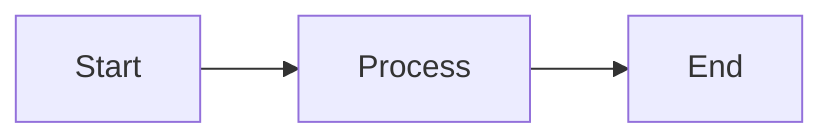

# Developer Guide

Complete guide for developers contributing to Open Tasks CLI or extending it for their needs.

## Getting Started

### Prerequisites

Before you begin, ensure you have:

- **Node.js** 18.x or later
- **npm** 8.x or later
- **Git** for version control
- **TypeScript** knowledge (basic to intermediate)
- **Code editor** (VS Code recommended)

### Initial Setup

1. **Clone the repository:**
```bash
git clone https://github.com/SergeiGolos/open-tasks.git
cd open-tasks
```

2. **Install dependencies:**
```bash
npm install
```

3. **Build the project:**
```bash
npm run build
```

4. **Run tests:**
```bash
npm test
```

5. **Link for local development:**
```bash
npm link
```

Now you can test your changes with `open-tasks` command globally.

## Project Structure

```
open-tasks/
├── src/                       # Source code
│   ├── commands/              # Built-in commands
│   │   ├── store.ts          # Store command
│   │   ├── load.ts           # Load command
│   │   ├── extract.ts        # Extract command
│   │   ├── replace.ts        # Replace command
│   │   ├── powershell.ts     # PowerShell command
│   │   ├── ai-cli.ts         # AI CLI integration
│   │   ├── init.ts           # Init command
│   │   └── create.ts         # Create command
│   ├── workflow/              # Workflow context
│   │   ├── directory-output-context.ts
│   │   ├── in-memory-context.ts
│   │   ├── decorators.ts
│   │   ├── transforms.ts
│   │   └── types.ts
│   ├── index.ts               # CLI entry point
│   ├── router.ts              # Command routing
│   ├── command-loader.ts      # Command discovery
│   ├── types.ts               # Type definitions
│   ├── formatters.ts          # Output formatting
│   ├── output-builders.ts     # Output builders
│   ├── card-builders.ts       # Card builders
│   └── utils.ts               # Utilities
├── test/                      # Tests
│   ├── commands.test.ts
│   ├── workflow.test.ts
│   ├── decorators.test.ts
│   ├── transforms.test.ts
│   └── ...
├── open-tasks-wiki/           # Documentation
├── templates/                 # Command templates
├── package.json
├── tsconfig.json              # TypeScript config
├── tsup.config.ts             # Build config
└── vitest.config.ts           # Test config
```

## Development Workflow

### 1. Make Changes

Edit files in the `src/` directory:

```bash
# Edit a command
code src/commands/store.ts

# Edit core types
code src/types.ts

# Edit workflow context
code src/workflow/directory-output-context.ts
```

### 2. Build

```bash
# Build once
npm run build

# Watch mode (rebuilds on changes)
npm run dev
```

### 3. Test

```bash
# Run all tests
npm test

# Run specific test
npm test commands.test

# Run with coverage
npm run test:coverage
```

### 4. Lint & Format

```bash
# Lint code
npm run lint

# Format code
npm run format
```

### 5. Test Locally

After linking with `npm link`:

```bash
# Test your changes
open-tasks store "test"
open-tasks load ./test.txt
```

## Adding a New Built-in Command

### Step 1: Create Command File

Create `src/commands/my-command.ts`:

```typescript
import { CommandHandler, ExecutionContext, ReferenceHandle } from '../types.js';
import { TokenDecorator } from '../workflow/decorators.js';

export default class MyCommandHandler extends CommandHandler {
  name = 'my-command';
  description = 'Description of what this command does';
  examples = [
    'open-tasks my-command arg1',
    'open-tasks my-command arg1 arg2'
  ];

  async execute(
    args: string[],
    refs: Map<string, ReferenceHandle>,
    context: ExecutionContext
  ): Promise<ReferenceHandle> {
    // Validate inputs
    if (args.length === 0) {
      throw new Error('Usage: open-tasks my-command <arg>');
    }

    // Get input
    const input = args[0];
    
    // Process
    const result = this.process(input);
    
    // Store output
    const memoryRef = await context.workflowContext.store(
      result,
      [new TokenDecorator('my-result')]
    );

    // Return reference
    return context.referenceManager.createReference(
      memoryRef.id,
      result,
      'my-command-output',
      memoryRef.fileName
    );
  }
  
  private process(input: string): string {
    // Your logic here
    return input.toUpperCase();
  }
}
```

### Step 2: Register Command

The command is auto-discovered from `src/commands/`, but ensure it's exported:

```typescript
// In src/commands/my-command.ts
export default class MyCommandHandler extends CommandHandler {
  // ...
}
```

### Step 3: Build and Test

```bash
# Build
npm run build

# Test manually
open-tasks my-command "test input"
```

### Step 4: Add Tests

Create `test/my-command.test.ts`:

```typescript
import { describe, it, expect } from 'vitest';
import MyCommandHandler from '../src/commands/my-command';

describe('MyCommandHandler', () => {
  it('should process input correctly', async () => {
    const handler = new MyCommandHandler();
    const args = ['test'];
    const refs = new Map();
    const context = createTestContext();
    
    const result = await handler.execute(args, refs, context);
    
    expect(result.content).toBe('TEST');
  });
  
  it('should throw error with no input', async () => {
    const handler = new MyCommandHandler();
    const args: string[] = [];
    const refs = new Map();
    const context = createTestContext();
    
    await expect(handler.execute(args, refs, context))
      .rejects.toThrow('Usage: open-tasks my-command <arg>');
  });
});

// Helper to create test context
function createTestContext(): ExecutionContext {
  // ... create mock context
}
```

### Step 5: Add Documentation

Add your command to `open-tasks-wiki/Commands.md`:

```markdown
### `my-command` - Description

Brief description of what the command does.

**Syntax:**
\`\`\`bash
open-tasks my-command <arg>
\`\`\`

**Examples:**
\`\`\`bash
open-tasks my-command "input"
\`\`\`
```

## Modifying Workflow Context

### Adding New Method

Edit `src/workflow/types.ts`:

```typescript
export interface IWorkflowContext {
  store(value: string, decorators: IMemoryDecorator[]): Promise<MemoryRef>;
  load(filePath: string, decorators: IMemoryDecorator[]): Promise<MemoryRef>;
  transform(ref: MemoryRef, transformer: ITransformer): Promise<MemoryRef>;
  
  // Add new method
  myNewMethod(param: string): Promise<MemoryRef>;
}
```

Implement in `src/workflow/directory-output-context.ts`:

```typescript
export class DirectoryOutputContext implements IWorkflowContext {
  // ... existing methods
  
  async myNewMethod(param: string): Promise<MemoryRef> {
    // Implementation
    return this.store(result, []);
  }
}
```

And in `src/workflow/in-memory-context.ts` for testing.

## Adding New Decorators

Create a new decorator in `src/workflow/decorators.ts`:

```typescript
export class MyDecorator implements IMemoryDecorator {
  constructor(private option: string) {}
  
  async decorate(ref: MemoryRef): Promise<MemoryRef> {
    return {
      ...ref,
      // Modify the reference
      metadata: {
        ...ref.metadata,
        myOption: this.option
      }
    };
  }
}
```

Use it:

```typescript
const ref = await context.workflowContext.store(
  data,
  [new MyDecorator('value')]
);
```

## Testing Guidelines

### Unit Tests

Test individual components:

```typescript
import { describe, it, expect, beforeEach } from 'vitest';

describe('MyComponent', () => {
  let component: MyComponent;
  
  beforeEach(() => {
    component = new MyComponent();
  });
  
  it('should do something', () => {
    const result = component.doSomething();
    expect(result).toBe('expected');
  });
});
```

### Integration Tests

Test command workflows:

```typescript
import { describe, it, expect } from 'vitest';
import { InMemoryWorkflowContext } from '../src/workflow/in-memory-context';

describe('Workflow Integration', () => {
  it('should chain commands correctly', async () => {
    const context = new InMemoryWorkflowContext();
    
    // Step 1
    const ref1 = await context.store('data', []);
    expect(ref1.content).toBe('data');
    
    // Step 2
    const ref2 = await context.transform(ref1, myTransformer);
    expect(ref2.content).toBe('transformed data');
  });
});
```

### E2E Tests

Test complete workflows:

```typescript
import { describe, it, expect } from 'vitest';
import { exec } from 'child_process';
import { promisify } from 'util';

const execAsync = promisify(exec);

describe('E2E Workflow', () => {
  it('should execute complete workflow', async () => {
    // Store
    await execAsync('open-tasks store "test" --token data');
    
    // Load
    const { stdout } = await execAsync('open-tasks load --ref data');
    expect(stdout).toContain('test');
  });
});
```

## Code Style

### TypeScript Conventions

```typescript
// Use interfaces for contracts
interface MyInterface {
  method(): void;
}

// Use classes for implementations
class MyClass implements MyInterface {
  method(): void {
    // Implementation
  }
}

// Use async/await
async function myFunction(): Promise<string> {
  const result = await someAsyncOperation();
  return result;
}

// Use destructuring
const { prop1, prop2 } = object;

// Use arrow functions for callbacks
array.map(item => item.value);
```

### Naming Conventions

- **Classes**: PascalCase (`MyClass`)
- **Interfaces**: PascalCase with `I` prefix (`IMyInterface`)
- **Functions**: camelCase (`myFunction`)
- **Variables**: camelCase (`myVariable`)
- **Constants**: UPPER_SNAKE_CASE (`MY_CONSTANT`)
- **Files**: kebab-case (`my-file.ts`)

### Error Handling

```typescript
// Throw descriptive errors
throw new Error('Descriptive error message with context');

// Handle errors gracefully
try {
  await riskyOperation();
} catch (error) {
  console.error('Operation failed:', error.message);
  throw error; // Re-throw if needed
}
```

### Comments

```typescript
// Use JSDoc for public APIs
/**
 * Process input data and return result
 * @param input - The input data
 * @param options - Processing options
 * @returns Processed result
 */
function process(input: string, options: Options): string {
  // Implementation
}

// Use inline comments for complex logic
// Calculate the optimal batch size based on memory constraints
const batchSize = Math.floor(availableMemory / itemSize);
```

## Building Documentation

The documentation is in `open-tasks-wiki/` directory.

### Adding New Pages

1. Create a new `.md` file
2. Add front matter:
```markdown
---
title: "Page Title"
---

# Page Title

Content here...
```

3. Add to index navigation
4. Include mermaid diagrams where helpful

### Mermaid Diagrams

Use mermaid for visual diagrams:

````markdown

````

## Release Process

### 1. Version Bump

```bash
# Bump version
npm version patch  # or minor, or major

# This updates package.json and creates a git tag
```

### 2. Build

```bash
npm run build
```

### 3. Test

```bash
npm test
npm run test:coverage
```

### 4. Publish

```bash
npm publish
```

### 5. Push Tags

```bash
git push && git push --tags
```

## Common Tasks

### Add New Dependency

```bash
# Add production dependency
npm install package-name

# Add dev dependency
npm install -D package-name
```

### Update Dependencies

```bash
# Update all
npm update

# Update specific package
npm update package-name
```

### Debug Issues

```bash
# Enable verbose logging
DEBUG=* open-tasks my-command

# Check TypeScript compilation
npx tsc --noEmit

# Check for type errors
npm run lint
```

## Contributing

### 1. Fork & Clone

```bash
git clone https://github.com/your-username/open-tasks.git
cd open-tasks
```

### 2. Create Branch

```bash
git checkout -b feature/my-feature
```

### 3. Make Changes

Follow the development workflow above.

### 4. Test Thoroughly

```bash
npm test
npm run lint
npm run format
```

### 5. Commit

```bash
git add .
git commit -m "feat: add new feature"
```

Use conventional commit messages:
- `feat:` - New feature
- `fix:` - Bug fix
- `docs:` - Documentation changes
- `test:` - Test changes
- `refactor:` - Code refactoring
- `chore:` - Build/tooling changes

### 6. Push & PR

```bash
git push origin feature/my-feature
```

Then create a Pull Request on GitHub.

## Troubleshooting

### Build Issues

```bash
# Clean and rebuild
rm -rf dist node_modules
npm install
npm run build
```

### Test Issues

```bash
# Run single test
npm test -- my-test.test.ts

# Run with verbose output
npm test -- --verbose
```

### Link Issues

```bash
# Unlink
npm unlink -g open-tasks-cli

# Rebuild and relink
npm run build
npm link
```

## Resources

- **TypeScript**: https://www.typescriptlang.org/docs/
- **Vitest**: https://vitest.dev/
- **Commander.js**: https://github.com/tj/commander.js/
- **Node.js**: https://nodejs.org/docs/

## Getting Help

- **GitHub Issues**: Report bugs or request features
- **GitHub Discussions**: Ask questions and share ideas
- **Documentation**: Check the wiki for guides and examples

## Next Steps

- **[[Architecture]]** - Understand the system design
- **[[Building-Custom-Commands]]** - Create new commands
- **[[Example-Tasks]]** - See real implementations
- **[[Commands]]** - Reference for built-in commands
