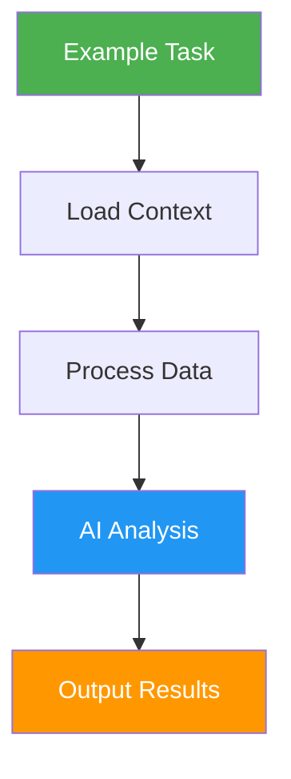
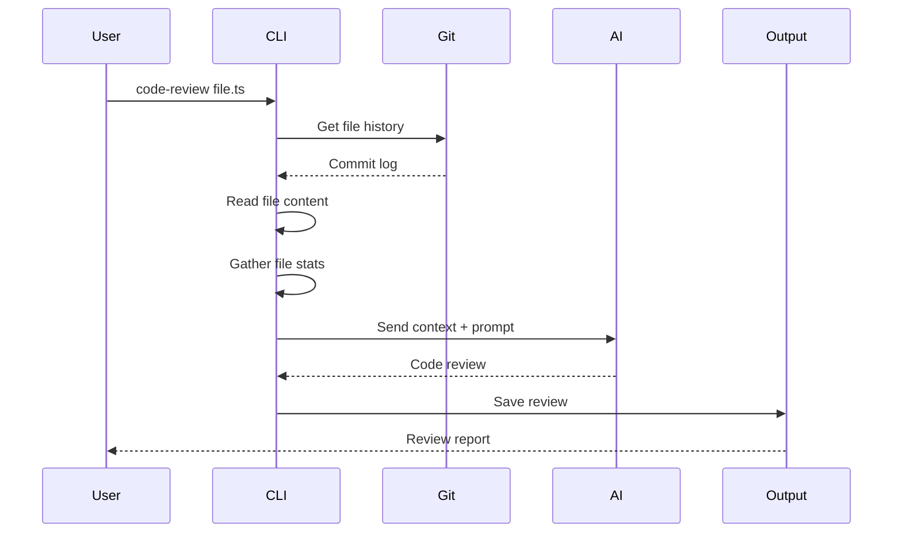
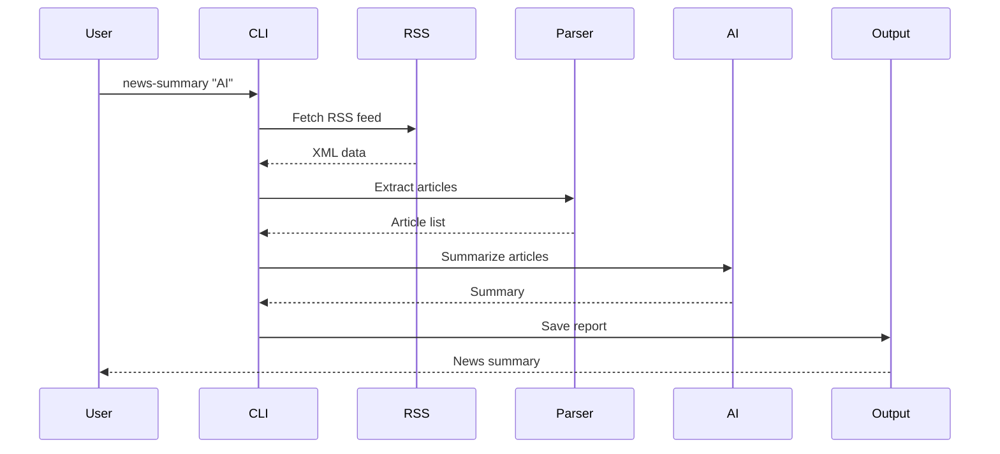
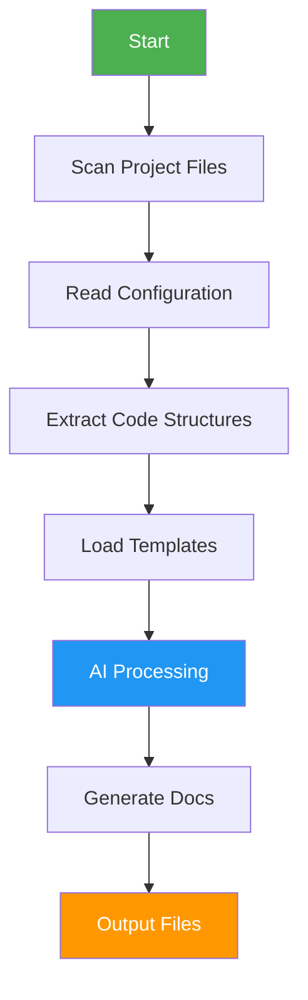

# Example Tasks

Real-world examples demonstrating how to build powerful workflows with Open Tasks CLI.

## Overview

These examples show how to combine built-in commands to create practical, AI-powered workflows. Each example includes the complete implementation and usage instructions.



## Example 1: Code Review Task

Automatically review code files with AI, including git history context.

### Implementation

Create `.open-tasks/commands/code-review.ts`:

```typescript
import { CommandHandler, ExecutionContext, ReferenceHandle } from 'open-tasks-cli';
import { TokenDecorator } from 'open-tasks-cli/decorators';
import * as child_process from 'child_process';
import { promisify } from 'util';
import * as fs from 'fs/promises';

const exec = promisify(child_process.exec);

export default class CodeReviewCommand extends CommandHandler {
  name = 'code-review';
  description = 'Review code file with AI and git history context';
  examples = [
    'open-tasks code-review ./src/api.ts',
    'open-tasks code-review ./src/api.ts --verbose'
  ];

  async execute(
    args: string[],
    refs: Map<string, ReferenceHandle>,
    context: ExecutionContext
  ): Promise<ReferenceHandle> {
    const filePath = args[0];
    
    if (!filePath) {
      throw new Error('Usage: open-tasks code-review <file-path>');
    }

    console.log(`🔍 Reviewing: ${filePath}`);

    // Step 1: Load the code file
    console.log('📖 Loading code file...');
    const code = await fs.readFile(filePath, 'utf-8');
    const codeRef = await context.workflowContext.store(
      code,
      [new TokenDecorator('code')]
    );

    // Step 2: Get git history for the file
    console.log('📜 Fetching git history...');
    let gitHistory = 'No git history available';
    try {
      const { stdout } = await exec(`git log --oneline -10 -- ${filePath}`);
      gitHistory = stdout.trim() || 'No commits found';
    } catch (error) {
      console.warn('⚠️  Could not fetch git history (not a git repository?)');
    }
    
    const historyRef = await context.workflowContext.store(
      gitHistory,
      [new TokenDecorator('history')]
    );

    // Step 3: Get file stats
    console.log('📊 Analyzing file...');
    const stats = await fs.stat(filePath);
    const lines = code.split('\n').length;
    const fileInfo = `
File: ${filePath}
Size: ${stats.size} bytes
Lines: ${lines}
Last Modified: ${stats.mtime.toISOString()}
    `.trim();

    const infoRef = await context.workflowContext.store(
      fileInfo,
      [new TokenDecorator('info')]
    );

    // Step 4: Build AI prompt with all context
    console.log('🤖 Requesting AI review...');
    
    const prompt = `
Please review this code file and provide a comprehensive analysis.

File Information:
${fileInfo}

Git History:
${gitHistory}

Code:
${code}

Please provide:
1. Overall code quality assessment
2. Potential bugs or issues
3. Security concerns
4. Performance considerations
5. Best practice recommendations
6. Specific improvement suggestions

Format your response in clear sections with examples where applicable.
    `.trim();

    // Step 5: Call AI CLI (if configured)
    let reviewContent = '';
    try {
      // Check if AI CLI is configured
      const aiConfigPath = '.open-tasks/ai-config.json';
      try {
        await fs.access(aiConfigPath);
        
        // AI is configured, use it
        const { stdout } = await exec(
          `open-tasks ai-cli "${prompt.replace(/"/g, '\\"')}" --ref code --ref history`
        );
        reviewContent = stdout;
      } catch {
        // AI not configured, provide template
        reviewContent = `
# Code Review: ${filePath}

${fileInfo}

## Git History
${gitHistory}

## Review
AI CLI is not configured. To enable AI-powered reviews:
1. Create .open-tasks/ai-config.json
2. Configure your AI CLI tool (GitHub Copilot, Claude, etc.)
3. Run this command again

For now, here's the code structure:
- Total lines: ${lines}
- File size: ${stats.size} bytes

## Manual Review Needed
Please review the code manually or configure AI CLI for automated analysis.
        `.trim();
      }
    } catch (error) {
      reviewContent = `Error generating review: ${error.message}`;
    }

    console.log('✅ Review complete!');

    // Step 6: Store the final review
    const reviewRef = await context.workflowContext.store(
      reviewContent,
      [new TokenDecorator('review')]
    );

    return context.referenceManager.createReference(
      reviewRef.id,
      reviewContent,
      'review',
      reviewRef.fileName
    );
  }
}
```

### Usage

```bash
# Initialize project (if not already done)
open-tasks init

# Create the command
open-tasks create code-review

# Review a file
open-tasks code-review ./src/api.ts

# Verbose output
open-tasks code-review ./src/api.ts --verbose

# Review and save to custom file
open-tasks code-review ./src/api.ts --file ./reviews/api-review.md
```

### What It Does



**Workflow Steps:**
1. Loads the specified code file
2. Fetches git history (last 10 commits)
3. Gathers file statistics (size, lines, modified date)
4. Sends all context to AI for analysis
5. Generates comprehensive review report
6. Saves report to output directory

**Output Example:**
```
🔍 Reviewing: ./src/api.ts
📖 Loading code file...
📜 Fetching git history...
📊 Analyzing file...
🤖 Requesting AI review...
✅ Review complete!

📁 Review saved: .open-tasks/outputs/20240119-143022-code-review/review.txt
```

---

## Example 2: News Summary Task

Fetch and summarize news articles from RSS feeds or APIs.

### Implementation

Create `.open-tasks/commands/news-summary.ts`:

```typescript
import { CommandHandler, ExecutionContext, ReferenceHandle } from 'open-tasks-cli';
import { TokenDecorator } from 'open-tasks-cli/decorators';
import * as child_process from 'child_process';
import { promisify } from 'util';

const exec = promisify(child_process.exec);

export default class NewsSummaryCommand extends CommandHandler {
  name = 'news-summary';
  description = 'Fetch and summarize news articles on a topic';
  examples = [
    'open-tasks news-summary "artificial intelligence"',
    'open-tasks news-summary "climate change" --count 5'
  ];

  async execute(
    args: string[],
    refs: Map<string, ReferenceHandle>,
    context: ExecutionContext
  ): Promise<ReferenceHandle> {
    const topic = args[0];
    const count = parseInt(args[1]) || 10;
    
    if (!topic) {
      throw new Error('Usage: open-tasks news-summary <topic> [count]');
    }

    console.log(`📰 Fetching news about: ${topic}`);
    console.log(`📊 Requesting ${count} articles`);

    // Step 1: Fetch articles using PowerShell/curl
    console.log('🔍 Searching for articles...');
    
    // Using a free RSS feed aggregator (example: NewsAPI alternative)
    // In production, you'd use an actual API with authentication
    const rssUrl = `https://news.google.com/rss/search?q=${encodeURIComponent(topic)}&hl=en-US&gl=US&ceid=US:en`;
    
    let articlesXml = '';
    try {
      const { stdout } = await exec(`curl -s "${rssUrl}"`);
      articlesXml = stdout;
    } catch (error) {
      throw new Error(`Failed to fetch news: ${error.message}`);
    }

    const articlesRef = await context.workflowContext.store(
      articlesXml,
      [new TokenDecorator('articles-xml')]
    );

    // Step 2: Extract article titles and links using regex
    console.log('📋 Extracting article information...');
    
    const titleMatches = articlesXml.matchAll(/<title><!\[CDATA\[(.*?)\]\]><\/title>/g);
    const linkMatches = articlesXml.matchAll(/<link>(.*?)<\/link>/g);
    
    const titles = Array.from(titleMatches).map(m => m[1]).slice(1, count + 1); // Skip first (feed title)
    const links = Array.from(linkMatches).map(m => m[1]).slice(1, count + 1);
    
    const articles = titles.map((title, i) => ({
      title,
      link: links[i] || 'N/A'
    }));

    console.log(`✅ Found ${articles.length} articles`);

    // Step 3: Format articles for AI
    const articlesText = articles
      .map((article, i) => `${i + 1}. ${article.title}\n   Link: ${article.link}`)
      .join('\n\n');

    const articlesRef2 = await context.workflowContext.store(
      articlesText,
      [new TokenDecorator('articles-list')]
    );

    // Step 4: Generate summary with AI
    console.log('🤖 Generating AI summary...');
    
    const prompt = `
Please provide a comprehensive summary of the following news articles about "${topic}".

Articles:
${articlesText}

Provide:
1. Main themes and trends
2. Key points from the articles
3. Different perspectives or viewpoints
4. Overall sentiment
5. Important takeaways

Format your response with clear sections and bullet points.
    `.trim();

    let summary = '';
    try {
      // Try to use AI CLI if configured
      const { stdout } = await exec(
        `echo "${prompt.replace(/"/g, '\\"')}" | open-tasks ai-cli -`
      );
      summary = stdout;
    } catch (error) {
      // Fallback to simple formatting
      summary = `
# News Summary: ${topic}

## Articles Found (${articles.length})

${articlesText}

## Summary

AI CLI is not configured. The articles are listed above.
Configure AI CLI in .open-tasks/ai-config.json to get intelligent summaries.

## Key Information
- Topic: ${topic}
- Articles Retrieved: ${articles.length}
- Date: ${new Date().toISOString()}
      `.trim();
    }

    console.log('✅ Summary generated!');

    // Step 5: Store final summary
    const summaryRef = await context.workflowContext.store(
      summary,
      [new TokenDecorator('news-summary')]
    );

    return context.referenceManager.createReference(
      summaryRef.id,
      summary,
      'news-summary',
      summaryRef.fileName
    );
  }
}
```

### Usage

```bash
# Create the command
open-tasks create news-summary

# Get news summary
open-tasks news-summary "artificial intelligence"

# Specify number of articles
open-tasks news-summary "climate change" 5

# Save to specific file
open-tasks news-summary "technology" --file ./reports/tech-news.md
```

### What It Does



**Workflow Steps:**
1. Fetches RSS feed for the specified topic
2. Parses XML to extract article titles and links
3. Formats articles for AI processing
4. Sends to AI for intelligent summarization
5. Generates formatted report
6. Saves to output directory

**Output Example:**
```
📰 Fetching news about: artificial intelligence
📊 Requesting 10 articles
🔍 Searching for articles...
📋 Extracting article information...
✅ Found 10 articles
🤖 Generating AI summary...
✅ Summary generated!

📁 Summary saved: .open-tasks/outputs/20240119-150145-news-summary/news-summary.txt
```

---

## Example 3: Project Documentation Generator

Generate comprehensive documentation for a project by analyzing its structure and code.

### Usage Pattern

```bash
# Create a custom task that combines multiple steps
open-tasks create doc-generator

# Implementation would:
# 1. List all source files
# 2. Read README and package.json
# 3. Extract key functions and classes
# 4. Generate API documentation with AI
# 5. Create structured Markdown output
```

### Workflow



---

## Example 4: Log Analysis Task

Analyze log files for errors, patterns, and insights.

### Usage Pattern

```bash
# Create log analyzer
open-tasks create log-analyzer

# Use it
open-tasks log-analyzer ./app.log

# Would:
# 1. Load log file
# 2. Extract error patterns
# 3. Count error types
# 4. Extract timestamps
# 5. Generate analysis report with AI
# 6. Create summary and recommendations
```

---

## Best Practices for Task Creation

### 1. Progressive Output
Provide feedback at each step:
```typescript
console.log('🔍 Step 1: Loading data...');
// ... do work
console.log('✅ Data loaded');

console.log('📊 Step 2: Processing...');
// ... do work
console.log('✅ Processing complete');
```

### 2. Error Handling
Always handle errors gracefully:
```typescript
try {
  const result = await riskyOperation();
} catch (error) {
  console.error(`❌ Error: ${error.message}`);
  throw new Error(`Failed to complete task: ${error.message}`);
}
```

### 3. Use References
Chain commands with references:
```typescript
// Store intermediate results
const ref1 = await context.workflowContext.store(
  data,
  [new TokenDecorator('step1')]
);

// Use in next step
const ref2 = await processData(ref1);
```

### 4. Provide Helpful Output
Make output useful and actionable:
```typescript
console.log('✅ Review complete!');
console.log('📁 Saved to:', outputFile);
console.log('💡 Next steps:');
console.log('   - Review the output file');
console.log('   - Address any issues found');
```

### 5. Add Usage Examples
Include clear examples in your command:
```typescript
examples = [
  'open-tasks my-command file.txt',
  'open-tasks my-command file.txt --verbose',
  'open-tasks my-command file.txt --output ./results/'
];
```

## Next Steps

- **[[Building-Custom-Tasks]]** - Learn to create your own tasks
- **[[Building-Custom-Commands]]** - Deep dive into command development
- **[[Commands]]** - Reference for all built-in commands
- **[[Architecture]]** - Understand the system design
