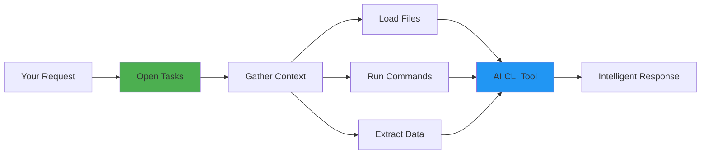
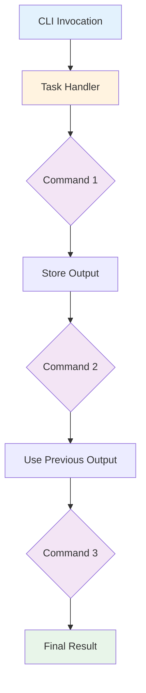
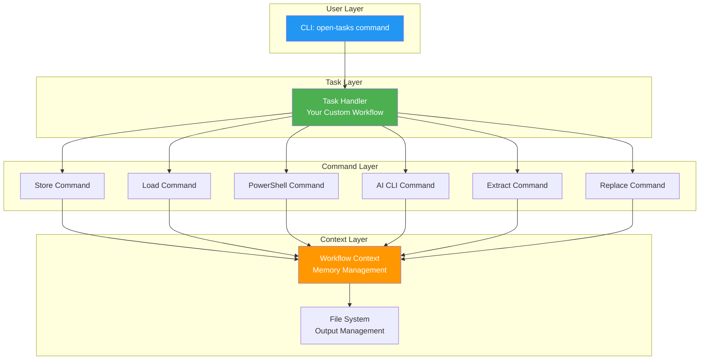

# Open Tasks CLI

**Open Tasks CLI** is a powerful framework for building AI-powered command-line workflows. It enables you to quickly write scripts that build context and execute agent CLI tools (like Claude Code, Codex, or Gemini CLI) with the ability to execute dependencies for building context in real-time, rather than depending on the LLM to figure out the tools it needs.

## 🎯 Value Proposition

Traditional AI CLI tools require you to manually gather context and often struggle with complex workflows. **Open Tasks CLI** solves this by:

- **Explicit Dependency Execution** - Define exactly what context to gather and how, executing dependencies in the right order automatically
- **Built for AI Agents** - Designed specifically to prepare context for AI CLI tools with a clean, typed interface
- **Quick TypeScript Syntax** - Write workflows in easy-to-understand TypeScript without boilerplate
- **Reusable Components** - Build a library of commands and tasks that can be composed together
- **Real-time Context Building** - Execute shell commands, load files, and transform data on-demand as your workflow runs

### Why Open Tasks?



Instead of manually gathering context files and hoping the AI understands your project structure, Open Tasks automates the entire workflow, ensuring your AI tools always have the right context.

## 🚀 Quick Example

Here's how you can analyze a repository with AI in just a few lines:

```typescript
// .open-tasks/tasks/analyze-repo.ts
import { CommandHandler, ExecutionContext, ReferenceHandle } from 'open-tasks-cli';

export default class AnalyzeRepoCommand extends CommandHandler {
  name = 'analyze-repo';
  description = 'Analyze repository with AI';
  examples = ['open-tasks analyze-repo'];

  async execute(
    args: string[],
    refs: Map<string, ReferenceHandle>,
    context: ExecutionContext
  ): Promise<ReferenceHandle> {
    // 1. Get git log
    const gitLog = await context.workflowContext.store(
      await this.runShellCommand('git log --oneline -10'),
      []
    );
    
    // 2. Get file structure
    const fileTree = await context.workflowContext.store(
      await this.runShellCommand('tree -L 3'),
      []
    );
    
    // 3. Pass to AI CLI with context
    const result = await this.runAI(
      'Analyze this repository structure and recent commits',
      [gitLog, fileTree]
    );
    
    return context.referenceManager.createReference(
      result.id,
      result.content,
      'analysis'
    );
  }
}
```

Run it: `open-tasks analyze-repo`

## 📚 Documentation

### Getting Started
- **[[Installation]]** - Install and set up Open Tasks CLI
- **[[Commands]]** - Available commands reference
- **[[Example-Tasks]]** - Real-world examples (code review, news summary)

### Building Your Own
- **[[Building-Custom-Tasks]]** - Create custom workflow tasks that chain commands together
- **[[Building-Custom-Commands]]** - Build reusable commands with the box format
- **[[Architecture]]** - Core concepts and high-level developer overview
- **[[Developer-Guide]]** - Development setup and coding additional tasks

## 🏗️ How It Works

Open Tasks uses a simple workflow model:



**Key Concepts:**

1. **Commands** - Individual operations (load file, run shell command, call AI)
2. **Tasks** - Workflows that chain commands together
3. **References** - Pass outputs between commands using tokens or UUIDs
4. **Context** - Automatic context management and file output

### Architecture Overview



## 💡 Example Use Cases

### Code Review Task
```bash
# Automatically gather context and get AI review
open-tasks code-review ./src/api.ts
```

This task can:
1. Load the file to review
2. Load related test files
3. Get git history for the file
4. Pass all context to AI for comprehensive review

### News Summary Task
```bash
# Fetch and summarize news articles
open-tasks news-summary "artificial intelligence"
```

This task can:
1. Fetch articles from RSS feeds or APIs
2. Extract article text
3. Pass to AI for summarization
4. Generate formatted report

## 🎨 Built-in Commands

- **`store`** - Store values and create references
- **`load`** - Load files and create references
- **`replace`** - Template substitution with tokens
- **`extract`** - Regex extraction from content
- **`powershell`** - Execute PowerShell scripts
- **`ai-cli`** - Integrate with AI CLI tools
- **`init`** - Initialize project structure
- **`create`** - Scaffold new tasks

See **[[Commands]]** for complete documentation.

## 🛠️ Technology

- **Runtime**: Node.js 18.x+
- **Language**: TypeScript (with full type safety)
- **CLI Framework**: Commander.js
- **Build Tool**: tsup
- **Testing**: Vitest

## 🤝 Contributing

We welcome contributions! See **[[Developer-Guide]]** for:
- Development environment setup
- Building and testing
- Code style and conventions
- Submitting changes

---

**Get Started**: `npm install -g open-tasks-cli` • **GitHub**: [SergeiGolos/open-tasks](https://github.com/SergeiGolos/open-tasks)